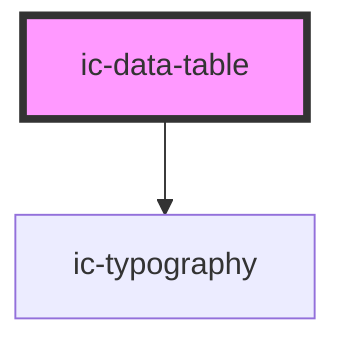

# ic-data-table

<!-- Auto Generated Below -->

## Properties

| Property               | Attribute             | Description | Type                                 | Default     |
| ---------------------- | --------------------- | ----------- | ------------------------------------ | ----------- |
| `columns` _(required)_ | --                    |             | `{ [key: string]: any; }[]`          | `undefined` |
| `data` _(required)_    | --                    |             | `{ [key: string]: any; }[]`          | `undefined` |
| `density`              | `density`             |             | `"default" \| "dense" \| "spacious"` | `"default"` |
| `embedded`             | `embedded`            |             | `boolean`                            | `false`     |
| `hideColumnHeaders`    | `hide-column-headers` |             | `boolean`                            | `false`     |
| `stickyColumn`         | `sticky-column`       |             | `boolean`                            | `false`     |
| `stickyRow`            | `sticky-row`          |             | `boolean`                            | `false`     |

## Dependencies

### Depends on

- [ic-typography](../ic-typography)

### Graph

----------------------------------------------

