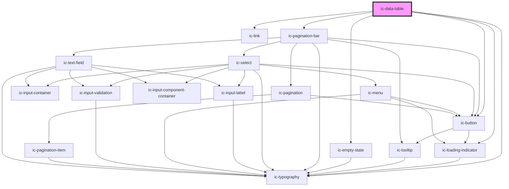

# ic-data-table

<!-- Auto Generated Below -->

## Properties

| Property                        | Attribute                          | Description                                                                                                                     | Type                                                                                                                                                                                                                        | Default                                                                                                                                                                                                                                                                   |
| ------------------------------- | ---------------------------------- | ------------------------------------------------------------------------------------------------------------------------------- | --------------------------------------------------------------------------------------------------------------------------------------------------------------------------------------------------------------------------- | ------------------------------------------------------------------------------------------------------------------------------------------------------------------------------------------------------------------------------------------------------------------------- |
| `caption` _(required)_          | `caption`                          | The title for the table only visible to screen readers.                                                                         | `string`                                                                                                                                                                                                                    | `undefined`                                                                                                                                                                                                                                                               |
| `columns` _(required)_          | --                                 | The column headers for the table.                                                                                               | `IcDataTableColumnObject[]`                                                                                                                                                                                                 | `undefined`                                                                                                                                                                                                                                                               |
| `data`                          | --                                 | The row content for the table.                                                                                                  | `{ [key: string]: any; }[]`                                                                                                                                                                                                 | `undefined`                                                                                                                                                                                                                                                               |
| `density`                       | `density`                          | Set the density of the table including font and padding.                                                                        | `"default" \| "dense" \| "spacious"`                                                                                                                                                                                        | `"default"`                                                                                                                                                                                                                                                               |
| `embedded`                      | `embedded`                         | Applies a border to the table container.                                                                                        | `boolean`                                                                                                                                                                                                                   | `false`                                                                                                                                                                                                                                                                   |
| `hideColumnHeaders`             | `hide-column-headers`              | If `true`, column headers will not be visible.                                                                                  | `boolean`                                                                                                                                                                                                                   | `false`                                                                                                                                                                                                                                                                   |
| `loading`                       | `loading`                          | When set to `true`, the full table will show a loading state, featuring a radial indicator.                                     | `boolean`                                                                                                                                                                                                                   | `false`                                                                                                                                                                                                                                                                   |
| `loadingOptions`                | --                                 | Sets the props for the circular loading indicator used in the loading state.                                                    | `{ appearance?: IcThemeForegroundNoDefault; description?: string; label?: string; labelDuration?: number; max?: number; min?: number; progress?: number; showBackground?: boolean; }`                                       | `undefined`                                                                                                                                                                                                                                                               |
| `minimumLoadingDisplayDuration` | `minimum-loading-display-duration` | The minimum amount of time the `loading` state displays for before showing the data. Used to prevent flashing in the component. | `number`                                                                                                                                                                                                                    | `1000`                                                                                                                                                                                                                                                                    |
| `paginationOptions`             | --                                 | Sets the props for the pagination bar.                                                                                          | `{ itemsPerPage?: { label: string; value: string; }[]; type?: IcPaginationTypes; control?: IcPaginationControlTypes; itemsPerPageControl?: boolean; goToPageControl?: boolean; alignment?: IcPaginationAlignmentOptions; }` | `{     itemsPerPage: [       { label: "10", value: "10" },       { label: "25", value: "25" },       { label: "50", value: "50" },     ],     type: "page",     control: "simple",     itemsPerPageControl: true,     goToPageControl: true,     alignment: "right",   }` |
| `showPagination`                | `show-pagination`                  | If `true`, adds a pagination bar to the bottom of the table.                                                                    | `boolean`                                                                                                                                                                                                                   | `false`                                                                                                                                                                                                                                                                   |
| `sortOptions`                   | --                                 | Sets the order columns will be sorted in and allows for 'default' sorts to be added.                                            | `{ sortOrders: IcDataTableSortOrderOptions[]; defaultColumn?: string; }`                                                                                                                                                    | `{     sortOrders: ["unsorted", "ascending", "descending"],     defaultColumn: "",   }`                                                                                                                                                                                   |
| `sortable`                      | `sortable`                         | If `true`, allows table columns to be sorted using applied sort buttons.                                                        | `boolean`                                                                                                                                                                                                                   | `false`                                                                                                                                                                                                                                                                   |
| `stickyColumnHeaders`           | `sticky-column-headers`            | If `true`, column headers will remain at the top of the table when scrolling vertically.                                        | `boolean`                                                                                                                                                                                                                   | `false`                                                                                                                                                                                                                                                                   |
| `stickyRowHeaders`              | `sticky-row-headers`               | If `true`, row headers will remain to the left when scrolling horizontally.                                                     | `boolean`                                                                                                                                                                                                                   | `false`                                                                                                                                                                                                                                                                   |
| `updating`                      | `updating`                         | If `true`, the table displays a linear loading indicator below the header row to indicate an updating state.                    | `boolean`                                                                                                                                                                                                                   | `false`                                                                                                                                                                                                                                                                   |
| `updatingOptions`               | --                                 | Sets the props for the linear loading indicator used in the updating state.                                                     | `{ appearance?: IcThemeForegroundNoDefault; description?: string; max?: number; min?: number; progress?: number; }`                                                                                                         | `undefined`                                                                                                                                                                                                                                                               |

## Slots

| Slot                         | Description                                                                                                                     |
| ---------------------------- | ------------------------------------------------------------------------------------------------------------------------------- |
| `"empty-state"`              | Content is placed below the table header when there is no data and the table is not loading.                                    |
| `"{COLUMN_TAG}-{ROW_INDEX}"` | Each cell should have its own slot, named using the column tag and the row index, allowing for custom elements to be displayed. |

## Dependencies

### Depends on

- [ic-loading-indicator](../ic-loading-indicator)
- [ic-typography](../ic-typography)
- [ic-link](../ic-link)
- [ic-button](../ic-button)
- [ic-empty-state](../ic-empty-state)
- [ic-pagination-bar](../ic-pagination-bar)

### Graph

----------------------------------------------

