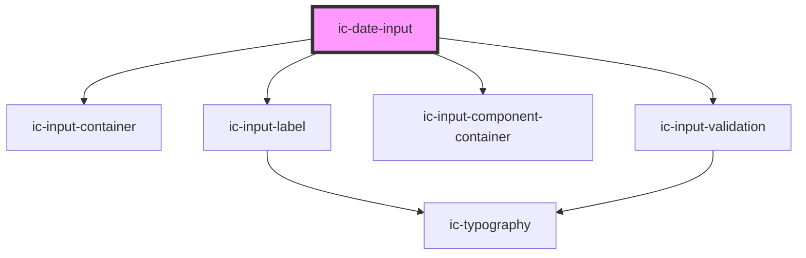

# ic-date-input

<!-- Auto Generated Below -->

## Properties

| Property              | Attribute                | Description                                                                                                                    | Type                                           | Default                                                                    |
| --------------------- | ------------------------ | ------------------------------------------------------------------------------------------------------------------------------ | ---------------------------------------------- | -------------------------------------------------------------------------- |
| `dateFormat`          | `date-format`            | The format in which the date will be displayed.                                                                                | `"DD/MM/YYYY" \| "MM/DD/YYYY" \| "YYYY/MM/DD"` | `"DD/MM/YYYY"`                                                             |
| `dateFromNowMessage`  | `date-from-now-message`  | The text to display as the validation message when `disabledDates` is `from-now` and a disabled date is entered.               | `string`                                       | `"Dates in the future are not allowed. Please select a date in the past."` |
| `dateUntilNowMessage` | `date-until-now-message` | The text to display as the validation message when `disabledDates` is `until-now` and a disabled date is entered.              | `string`                                       | `"Dates in the past are not allowed. Please select a date in the future."` |
| `disabled`            | `disabled`               | If `true`, the disabled state will be set.                                                                                     | `boolean`                                      | `false`                                                                    |
| `disabledDates`       | `disabled-dates`         | The dates (until now or from now) that the user cannot select. A validation message will appear if they enter a disabled date. | `"from-now" \| "until-now"`                    | `undefined`                                                                |
| `helperText`          | `helper-text`            | The helper text that will be displayed for additional field guidance. This will default to the `dateFormat` value.             | `string`                                       | `undefined`                                                                |
| `inputId`             | `input-id`               | The ID for the input.                                                                                                          | `string`                                       | ``ic-date-input-${inputIds++}``                                            |
| `label` _(required)_  | `label`                  | The label for the date input.                                                                                                  | `string`                                       | `undefined`                                                                |
| `name`                | `name`                   | The name of the control, which is submitted with the form data.                                                                | `string`                                       | `this.inputId`                                                             |
| `required`            | `required`               | If `true`, the input will require a value.                                                                                     | `boolean`                                      | `false`                                                                    |
| `validationStatus`    | `validation-status`      | The validation status - e.g. 'error' \| 'warning' \| 'success'. This will override the built-in date validation.               | `"" \| "error" \| "success" \| "warning"`      | `""`                                                                       |
| `validationText`      | `validation-text`        | The text to display as the validation message. This will override the built-in date validation.                                | `string`                                       | `""`                                                                       |
| `value`               | `value`                  | The value of the date input - in ISO 8601 date string format (`yyyy-mm-dd`) or as a JavaScript `Date` object.                  | `Date \| string`                               | `""`                                                                       |

## Events

| Event      | Description                         | Type                            |
| ---------- | ----------------------------------- | ------------------------------- |
| `icBlur`   | Emitted when the input loses focus. | `CustomEvent<{ value: Date; }>` |
| `icChange` | Emitted when the value has changed. | `CustomEvent<{ value: Date; }>` |
| `icFocus`  | Emitted when the input gains focus. | `CustomEvent<{ value: Date; }>` |

## Methods

### `getDate() => Promise<Date>`

Returns the value as a Date object

#### Returns

Type: `Promise<Date>`

Date

## Dependencies

### Depends on

- [ic-input-container](../ic-input-container)
- [ic-input-label](../ic-input-label)
- [ic-input-component-container](../ic-input-component-container)
- [ic-input-validation](../ic-input-validation)

### Graph

----------------------------------------------

