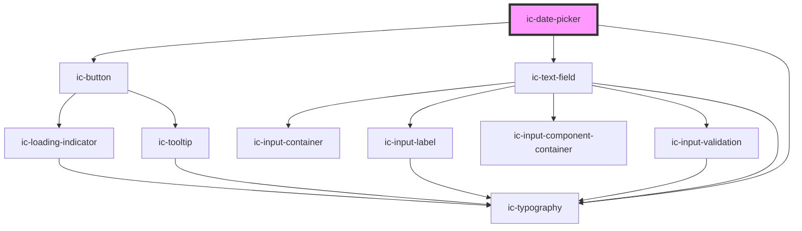

# ic-date-picker

<!-- Auto Generated Below -->

## Properties

| Property               | Attribute                 | Description                                                                                                                                                                               | Type                                                                                                                                        | Default           |
| ---------------------- | ------------------------- | ----------------------------------------------------------------------------------------------------------------------------------------------------------------------------------------- | ------------------------------------------------------------------------------------------------------------------------------------------- | ----------------- |
| `backBehaviour`        | `back-behaviour`          | The size of the date picker to be displayed.                                                                                                                                              | `boolean`                                                                                                                                   | `false`           |
| `disabledDays`         | --                        | Days.                                                                                                                                                                                     | `WeekDays[]`                                                                                                                                | `[]`              |
| `focusDayOnOpen`       | `focus-day-on-open`       | Determines whether the selected day should receive focus when calendar is opened. If `true` and no day selected then the current day or first focussable day in range will receive focus. | `boolean`                                                                                                                                   | `false`           |
| `max`                  | `max`                     | Maximum date allowed to be picked. Must be in IS0-8601 format: YYYY-MM-DD.                                                                                                                | `string`                                                                                                                                    | `""`              |
| `min`                  | `min`                     | Minimum date allowed to be picked. Must be in IS0-8601 format: YYYY-MM-DD.                                                                                                                | `string`                                                                                                                                    | `""`              |
| `showDaysOutsideMonth` | `show-days-outside-month` | Determines whether days outside the current month are rendered.                                                                                                                           | `boolean`                                                                                                                                   | `true`            |
| `size`                 | `size`                    | The size of the date picker to be displayed.                                                                                                                                              | `"default" \| "large" \| "small"`                                                                                                           | `"default"`       |
| `startOfWeek`          | `start-of-week`           | The first day of the week? `0` for Sunday, `1` for Monday, etc. Default is Monday.                                                                                                        | `WeekDays.Friday \| WeekDays.Monday \| WeekDays.Saturday \| WeekDays.Sunday \| WeekDays.Thursday \| WeekDays.Tuesday \| WeekDays.Wednesday` | `WeekDays.Monday` |
| `todayButton`          | `today-button`            | Determines whether a Go to today button should appear on the picker.                                                                                                                      | `boolean`                                                                                                                                   | `true`            |

## Dependencies

### Depends on

- [ic-button](../ic-button)
- [ic-text-field](../ic-text-field)
- [ic-typography](../ic-typography)

### Graph

----------------------------------------------

