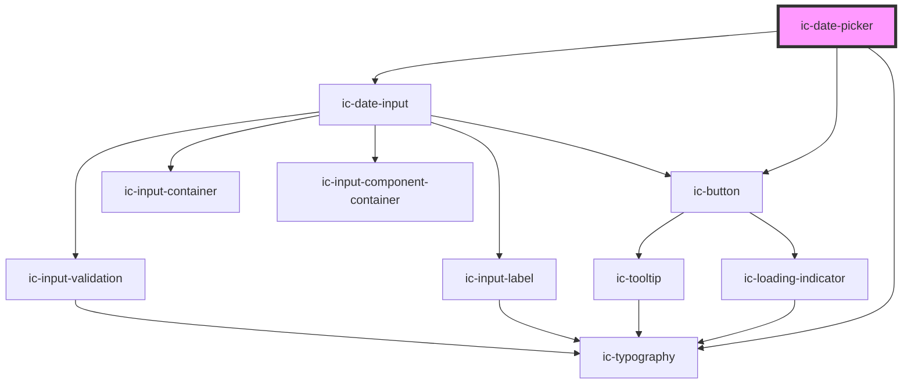

# ic-date-picker

<!-- Auto Generated Below -->

## Properties

| Property                | Attribute                  | Description                                                                                                                                                                                       | Type                                                                                                                                                      | Default                                                                                         |
| ----------------------- | -------------------------- | ------------------------------------------------------------------------------------------------------------------------------------------------------------------------------------------------- | --------------------------------------------------------------------------------------------------------------------------------------------------------- | ----------------------------------------------------------------------------------------------- |
| `dateFormat`            | `date-format`              | The format in which the date will be displayed.                                                                                                                                                   | `"DD/MM/YYYY" \| "MM/DD/YYYY" \| "YYYY/MM/DD"`                                                                                                            | `"DD/MM/YYYY"`                                                                                  |
| `dateFromNowMessage`    | `date-from-now-message`    | The text to display as the validation message when `disableFromNow` is true and a disabled date is entered in the input field.                                                                    | `string`                                                                                                                                                  | `"Dates in the future are not allowed. Please select a date in the past."`                      |
| `dateUntilNowMessage`   | `date-until-now-message`   | The text to display as the validation message when `disableUntilNow` is true and a disabled date is entered in the input field.                                                                   | `string`                                                                                                                                                  | `"Dates in the past are not allowed. Please select a date in the future."`                      |
| `disableDays`           | --                         | The days of the week to disable.                                                                                                                                                                  | `IcWeekDays[]`                                                                                                                                            | `[]`                                                                                            |
| `disableDaysMessage`    | `disable-days-message`     | The text to display as the validation message when `disableDays` is set and a disabled date is entered.                                                                                           | `string`                                                                                                                                                  | `"The date you have selected is on a weekday that is not allowed. Please select another date."` |
| `disableFromNow`        | `disable-from-now`         | If `true`, the user cannot select dates from now. A validation message will appear if they enter a disabled date.                                                                                 | `boolean`                                                                                                                                                 | `false`                                                                                         |
| `disableUntilNow`       | `disable-until-now`        | If `true`, the user cannot select dates until now. A validation message will appear if they enter a disabled date.                                                                                | `boolean`                                                                                                                                                 | `false`                                                                                         |
| `disabled`              | `disabled`                 | If `true`, the disabled state will be set.                                                                                                                                                        | `boolean`                                                                                                                                                 | `false`                                                                                         |
| `focusDayOnOpen`        | `focus-day-on-open`        | Determines whether the selected day should receive focus when calendar is opened. If `true` and no day selected then the current day or first focussable day in range will receive focus.         | `boolean`                                                                                                                                                 | `true`                                                                                          |
| `helperText`            | `helper-text`              | The helper text that will be displayed for additional field guidance. This will default to the `dateFormat` value.                                                                                | `string`                                                                                                                                                  | `undefined`                                                                                     |
| `inputId`               | `input-id`                 | The ID for the input field. The default will be an automatically generated value.                                                                                                                 | `string`                                                                                                                                                  | `undefined`                                                                                     |
| `label` _(required)_    | `label`                    | The label for the date input.                                                                                                                                                                     | `string`                                                                                                                                                  | `undefined`                                                                                     |
| `max`                   | `max`                      | The latest date that will be allowed - in ISO 8601 date string format (`yyyy-mm-dd`) or as a JavaScript `Date` object. The value of this prop is ignored if `disableFromNow` is set to `true`.    | `Date \| string`                                                                                                                                          | `""`                                                                                            |
| `min`                   | `min`                      | The earliest date that will be allowed - in ISO 8601 date string format (`yyyy-mm-dd`) or as a JavaScript `Date` object. The value of this prop is ignored if `disableUntilNow` is set to `true`. | `Date \| string`                                                                                                                                          | `""`                                                                                            |
| `name`                  | `name`                     | The name of the control, which is submitted with the form data.                                                                                                                                   | `string`                                                                                                                                                  | `undefined`                                                                                     |
| `openAtDate`            | `open-at-date`             | The date visible when the calendar opens. Used if no date is currently selected. In ISO 8601 date string format (`yyyy-mm-dd`) or as a JavaScript `Date` object.                                  | `Date \| string`                                                                                                                                          | `""`                                                                                            |
| `required`              | `required`                 | If `true`, the input will require a value.                                                                                                                                                        | `boolean`                                                                                                                                                 | `false`                                                                                         |
| `showDaysOutsideMonth`  | `show-days-outside-month`  | Determines whether days outside the current month are rendered.                                                                                                                                   | `boolean`                                                                                                                                                 | `true`                                                                                          |
| `showPickerClearButton` | `show-picker-clear-button` | Determines whether the `Clear` button on the date picker is visible.                                                                                                                              | `boolean`                                                                                                                                                 | `true`                                                                                          |
| `showPickerTodayButton` | `show-picker-today-button` | Determines whether the `Go to today` button on the date picker is visible.                                                                                                                        | `boolean`                                                                                                                                                 | `true`                                                                                          |
| `size`                  | `size`                     | The size of the date picker to be displayed.                                                                                                                                                      | `"default" \| "large" \| "small"`                                                                                                                         | `"default"`                                                                                     |
| `startOfWeek`           | `start-of-week`            | The first day of the week? `0` for Sunday, `1` for Monday, etc. Default is Monday.                                                                                                                | `IcWeekDays.Friday \| IcWeekDays.Monday \| IcWeekDays.Saturday \| IcWeekDays.Sunday \| IcWeekDays.Thursday \| IcWeekDays.Tuesday \| IcWeekDays.Wednesday` | `IcWeekDays.Monday`                                                                             |
| `validationStatus`      | `validation-status`        | The validation status - e.g. 'error' \| 'warning' \| 'success'. This will override the built-in date validation.                                                                                  | `"" \| "error" \| "success" \| "warning"`                                                                                                                 | `""`                                                                                            |
| `validationText`        | `validation-text`          | The text to display as the validation message. This will override the built-in date validation.                                                                                                   | `string`                                                                                                                                                  | `""`                                                                                            |
| `value`                 | `value`                    | The value of the date picker - in ISO 8601 date string format (`yyyy-mm-dd`) or as a JavaScript `Date` object.                                                                                    | `Date \| string`                                                                                                                                          | `""`                                                                                            |

## CSS Custom Properties

| Name            | Description              |
| --------------- | ------------------------ |
| `--input-width` | Width of the input field |

## Dependencies

### Depends on

- [ic-button](../ic-button)
- [ic-date-input](../ic-date-input)
- [ic-typography](../ic-typography)

### Graph

----------------------------------------------

