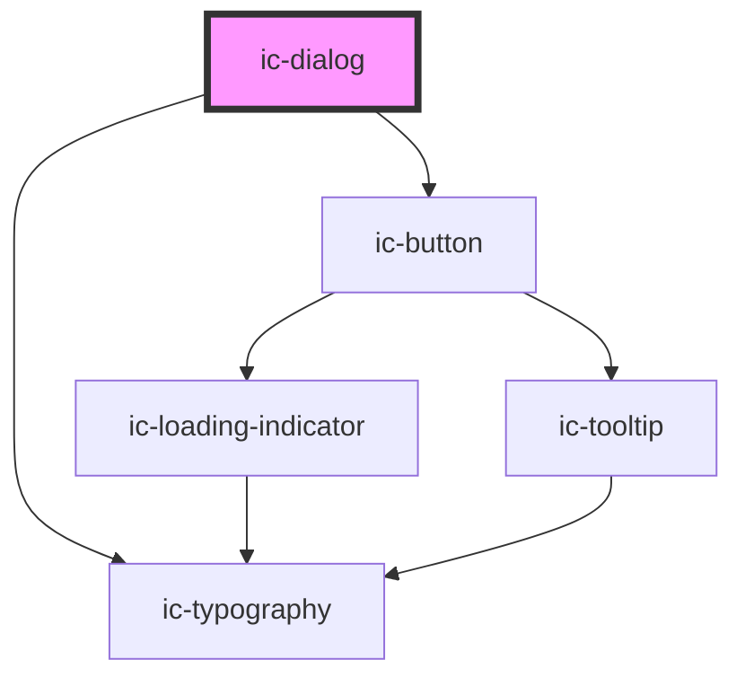

# ic-dialog

<!-- Auto Generated Below -->

## Properties

| Property                  | Attribute                   | Description                                                                                                                                                                                                           | Type                             | Default     |
| ------------------------- | --------------------------- | --------------------------------------------------------------------------------------------------------------------------------------------------------------------------------------------------------------------- | -------------------------------- | ----------- |
| `buttons`                 | `buttons`                   | If set to `false`, default buttons or slotted dialog controls will not be displayed.                                                                                                                                  | `boolean`                        | `true`      |
| `closeOnBackdropClick`    | `close-on-backdrop-click`   | If set to `false`, the dialog will not close when the backdrop is clicked.                                                                                                                                            | `boolean`                        | `true`      |
| `destructive`             | `destructive`               | If default buttons are displayed, sets the 'primary' or rightmost button to the destructive variant. Stops initial focus being set on the 'primary' or rightmost default or slotted button.                           | `boolean`                        | `false`     |
| `disableHeightConstraint` | `disable-height-constraint` | If set to `true`, the content area max height and overflow properties are removed allowing the dialog to stretch below the fold. This prop also prevents popover elements from being cut off within the content area. | `boolean`                        | `false`     |
| `disableWidthConstraint`  | `disable-width-constraint`  | If set to `true`, the content area width property is removed, allowing content to take the full width of the dialog when using the large variant.                                                                     | `boolean`                        | `false`     |
| `dismissLabel`            | `dismiss-label`             | Sets the dismiss label tooltip and aria label.                                                                                                                                                                        | `string`                         | `"Dismiss"` |
| `heading`                 | `heading`                   | Sets the heading for the dialog.                                                                                                                                                                                      | `string`                         | `undefined` |
| `hideCloseButton`         | `hide-close-button`         | If `true`, the close button will not be displayed.                                                                                                                                                                    | `boolean`                        | `false`     |
| `label`                   | `label`                     | Sets the optional label for the dialog which appears above the heading.                                                                                                                                               | `string`                         | `undefined` |
| `open`                    | `open`                      | If `true`, the dialog will be displayed.                                                                                                                                                                              | `boolean`                        | `undefined` |
| `size`                    | `size`                      | Sets the maximum and minimum height and width for the dialog.                                                                                                                                                         | `"large" \| "medium" \| "small"` | `"small"`   |

## Events

| Event               | Description                                                                                                   | Type                |
| ------------------- | ------------------------------------------------------------------------------------------------------------- | ------------------- |
| `icDialogCancelled` | Cancelation event emitted when default 'Cancel' button clicked or 'cancelDialog' method is called.            | `CustomEvent<void>` |
| `icDialogClosed`    | Emitted when dialog has closed.                                                                               | `CustomEvent<void>` |
| `icDialogConfirmed` | Confirmation event emitted when default 'Confirm' primary button clicked or 'confirmDialog' method is called. | `CustomEvent<void>` |
| `icDialogOpened`    | Emitted when dialog has opened.                                                                               | `CustomEvent<void>` |

## Methods

### `cancelDialog() => Promise<void>`

Cancels the dialog. Used by the default 'Cancel' button or can be called manually to trigger cancelling of dialog.

#### Returns

Type: `Promise<void>`

### `confirmDialog() => Promise<void>`

Confirms the dialog. Used by the default 'Confirm' button or can be called manually to trigger confirming of dialog.

#### Returns

Type: `Promise<void>`

## Slots

| Slot                | Description                                                          |
| ------------------- | -------------------------------------------------------------------- |
| `"alert"`           | Content will be placed at the top of the content area of the dialog. |
| `"dialog-controls"` | Content will be place at the bottom of the dialog.                   |
| `"heading"`         | Content will be placed at the top of the dialog.                     |
| `"label"`           | Content will be placed above the dialog heading.                     |

## Dependencies

### Depends on

- [ic-typography](../ic-typography)
- [ic-button](../ic-button)

### Graph

----------------------------------------------

