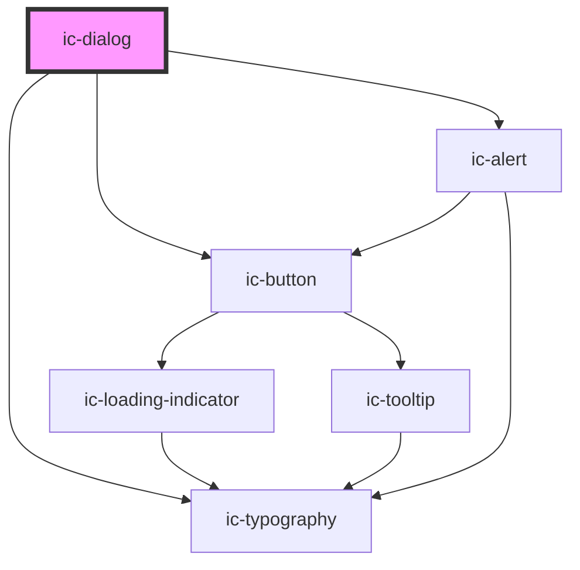

# ic-dialog

<!-- Auto Generated Below -->

## Properties

| Property               | Attribute                 | Description                                                                                                                                                                                 | Type                                                       | Default                                                                                                                                            |
| ---------------------- | ------------------------- | ------------------------------------------------------------------------------------------------------------------------------------------------------------------------------------------- | ---------------------------------------------------------- | -------------------------------------------------------------------------------------------------------------------------------------------------- |
| `alertHeading`         | `alert-heading`           | If a status is set, sets the heading for the displayed alert.                                                                                                                               | `string`                                                   | `undefined`                                                                                                                                        |
| `alertMessage`         | `alert-message`           | If a status is set, sets the message for the displayed alert.                                                                                                                               | `string`                                                   | `undefined`                                                                                                                                        |
| `buttonProps`          | --                        | Sets the label and onclick functions for default buttons.                                                                                                                                   | `{ label: string; onclick: string; }[]`                    | `[     { label: "Cancel", onclick: "this.hideDialog(); this.icDialogCancel()" },     { label: "Confirm", onclick: "this.icDialogConfirm()" },   ]` |
| `buttons`              | `buttons`                 | If set to `false`, dialog controls will not be displayed overriding buttonProps or slotted dialog controls.                                                                                 | `boolean`                                                  | `true`                                                                                                                                             |
| `closeOnBackdropClick` | `close-on-backdrop-click` | If set to `true`, the dialog will not close when the backdrop is clicked.                                                                                                                   | `boolean`                                                  | `true`                                                                                                                                             |
| `destructive`          | `destructive`             | If default buttons are displayed, sets the 'primary' or rightmost button to the destructive variant. Stops initial focus being set on the 'primary' or rightmost default or slotted button. | `boolean`                                                  | `false`                                                                                                                                            |
| `dismissLabel`         | `dismiss-label`           | Sets the dismiss label tooltip and aria label.                                                                                                                                              | `string`                                                   | `"Dismiss"`                                                                                                                                        |
| `heading` _(required)_ | `heading`                 | Sets the heading for the dialog.                                                                                                                                                            | `string`                                                   | `undefined`                                                                                                                                        |
| `label`                | `label`                   | Sets the optional label for the dialog which appears above the heading.                                                                                                                     | `string`                                                   | `undefined`                                                                                                                                        |
| `size`                 | `size`                    | Sets the maximum and minimum height and width for the dialog.                                                                                                                               | `"large" \| "medium" \| "small"`                           | `"small"`                                                                                                                                          |
| `status`               | `status`                  | If set, displays an alert of the corresponding variant below the heading.                                                                                                                   | `"error" \| "info" \| "neutral" \| "success" \| "warning"` | `undefined`                                                                                                                                        |

## Events

| Event               | Description                                              | Type                |
| ------------------- | -------------------------------------------------------- | ------------------- |
| `icDialogCanceled`  | Cancelation event for default 'Cancel' button behaviour. | `CustomEvent<void>` |
| `icDialogConfirmed` | Confirmation event for default primary button behaviour. | `CustomEvent<void>` |

## Methods

### `hideDialog() => Promise<void>`

Used to dismiss the dialog.

#### Returns

Type: `Promise<void>`

### `showDialog() => Promise<void>`

Used to display the dialog.

#### Returns

Type: `Promise<void>`

## Dependencies

### Depends on

- [ic-typography](../ic-typography)
- [ic-button](../ic-button)
- [ic-alert](../ic-alert)

### Graph

----------------------------------------------

