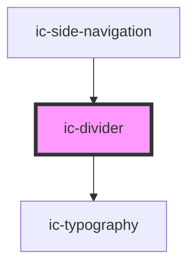

# ic-divider

<!-- Auto Generated Below -->

## Properties

| Property         | Attribute         | Description                                                                                                                                                                                                                                                                              | Type                                                 | Default        |
| ---------------- | ----------------- | ---------------------------------------------------------------------------------------------------------------------------------------------------------------------------------------------------------------------------------------------------------------------------------------- | ---------------------------------------------------- | -------------- |
| `appearance`     | `appearance`      | The appearance of the divider.                                                                                                                                                                                                                                                           | `"dark" \| "default" \| "light" \| "theme"`          | `"default"`    |
| `borderStyle`    | `border-style`    | The line style of the divider.                                                                                                                                                                                                                                                           | `"dashed" \| "solid"`                                | `"solid"`      |
| `label`          | `label`           | The label for the divider.                                                                                                                                                                                                                                                               | `string`                                             | `undefined`    |
| `labelPlacement` | `label-placement` | The position the label is placed on the divider. `Left` and `right` placement is only applicable when orientation is set to `horizontal`. `Top` and `bottom` placement is only applicable when orientation is set to `vertical`. `Center` placement is applicable for both orientations. | `"bottom" \| "center" \| "left" \| "right" \| "top"` | `"center"`     |
| `orientation`    | `orientation`     | The orientation of the divider.                                                                                                                                                                                                                                                          | `"horizontal" \| "vertical"`                         | `"horizontal"` |
| `weight`         | `weight`          | The thickness of the divider.                                                                                                                                                                                                                                                            | `"medium" \| "thick" \| "thin" \| "very-thick"`      | `"thin"`       |

## CSS Custom Properties

| Name                            | Description                                                        |
| ------------------------------- | ------------------------------------------------------------------ |
| `--ic-divider-horizontal-width` | The width of a horizontal divider. The default value is `inherit`. |
| `--ic-divider-vertical-height`  | The height of a vertical divider. The default value is `inherit`.  |
| `--ic-divider-weight`           | The thickness of the divider.                                      |

## Dependencies

### Used by

 - [ic-side-navigation](../ic-side-navigation)

### Depends on

- [ic-typography](../ic-typography)

### Graph

----------------------------------------------

