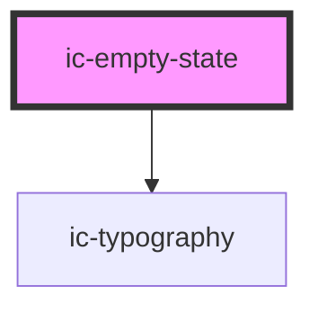

# ic-empty-state

<!-- Auto Generated Below -->

## Properties

| Property     | Attribute    | Description                                                    | Type                             | Default     |
| ------------ | ------------ | -------------------------------------------------------------- | -------------------------------- | ----------- |
| `aligned`    | `aligned`    | The alignment of the empty state container.                    | `"center" \| "left" \| "right"`  | `"left"`    |
| `body`       | `body`       | The body text rendered in the empty state container.           | `string`                         | `undefined` |
| `heading`    | `heading`    | The title rendered in the empty state container.               | `string`                         | `undefined` |
| `imageSize`  | `image-size` | The size of the image or icon used in the image slot.          | `"large" \| "medium" \| "small"` | `"medium"`  |
| `maxLines`   | `max-lines`  | The number of lines of body text to display before truncating. | `number`                         | `undefined` |
| `subheading` | `subheading` | The subtitle rendered in the empty state container.            | `string`                         | `undefined` |

## Slots

| Slot           | Description                                               |
| -------------- | --------------------------------------------------------- |
| `"actions"`    | Content is placed at the bottom below all other content.  |
| `"body"`       | Content will be rendered in place of the body prop.       |
| `"heading"`    | Content will be rendered in place of the heading prop.    |
| `"image"`      | Content is placed at the top above all other content.     |
| `"subheading"` | Content will be rendered in place of the subheading prop. |

## Dependencies

### Depends on

- [ic-typography](../ic-typography)

### Graph

----------------------------------------------

