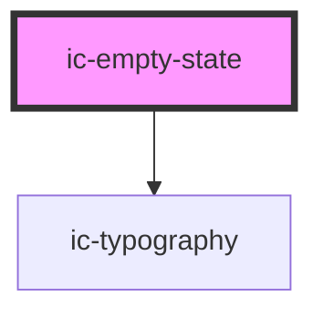

# ic-empty-state

<!-- Auto Generated Below -->

## Properties

| Property               | Attribute        | Description                                                    | Type                              | Default     |
| ---------------------- | ---------------- | -------------------------------------------------------------- | --------------------------------- | ----------- |
| `aligned`              | `aligned`        | The alignment of the empty state container.                    | `"center" \| "left" \| "right"`   | `"left"`    |
| `body`                 | `body`           | The body text rendered in the empty state container.           | `string`                          | `undefined` |
| `bodyMaxLines`         | `body-max-lines` | The number of lines of body text to display before truncating. | `number`                          | `undefined` |
| `heading` _(required)_ | `heading`        | The title rendered in the empty state container.               | `string`                          | `undefined` |
| `imageSize`            | `image-size`     | The size of the image or icon used in the image slot.          | `"default" \| "large" \| "small"` | `"default"` |
| `subheading`           | `subheading`     | The subtitle rendered in the empty state container.            | `string`                          | `undefined` |

## Slots

| Slot        | Description                                              |
| ----------- | -------------------------------------------------------- |
| `"actions"` | Content is placed at the bottom below all other content. |
| `"image"`   | Content is placed at the top above all other content.    |

## Dependencies

### Depends on

- [ic-typography](../ic-typography)

### Graph

----------------------------------------------

