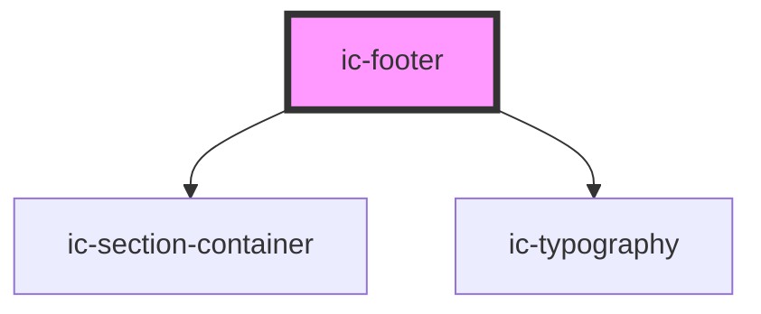

# ic-footer

<!-- Auto Generated Below -->

## Properties

| Property      | Attribute     | Description                                                                             | Type                                                               | Default     |
| ------------- | ------------- | --------------------------------------------------------------------------------------- | ------------------------------------------------------------------ | ----------- |
| `aligned`     | `aligned`     | The alignment of the section containers used within the footer.                         | `"center" \| "full-width" \| "left"`                               | `"left"`    |
| `breakpoint`  | `breakpoint`  | The screen size breakpoint at which to switch to the small layout.                      | `"extra large" \| "extra small" \| "large" \| "medium" \| "small"` | `"medium"`  |
| `caption`     | `caption`     | The caption displayed at the bottom of the footer.                                      | `string`                                                           | `undefined` |
| `copyright`   | `copyright`   | If `true`, the footer will display the crown copyright at the bottom.                   | `boolean`                                                          | `true`      |
| `description` | `description` | The description displayed at the top of the footer.                                     | `string`                                                           | `undefined` |
| `groupLinks`  | `group-links` | If `true`, the footer will be set up to handle link groups instead of standalone links. | `boolean`                                                          | `false`     |

## Events

| Event             | Description                                                                        | Type                |
| ----------------- | ---------------------------------------------------------------------------------- | ------------------- |
| `icFooterResized` | Triggers on page resize and triggers style changes in footer links and link groups | `CustomEvent<void>` |

## Slots

| Slot            | Description                                             |
| --------------- | ------------------------------------------------------- |
| `"caption"`     | Content will be rendered above Crown Copyright.         |
| `"description"` | Content will be rendered at the top of the footer.      |
| `"link"`        | Content will be rendered between description and logos. |
| `"logo"`        | Content will be rendered underneath footer links.       |

## Dependencies

### Depends on

- [ic-section-container](../ic-section-container)
- [ic-typography](../ic-typography)

### Graph

----------------------------------------------

