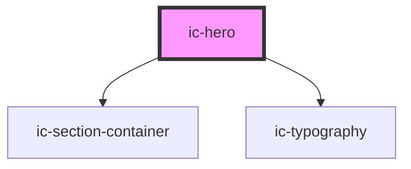

# ic-hero

<!-- Auto Generated Below -->

## Properties

| Property                    | Attribute                     | Description                                                                       | Type                                 | Default     |
| --------------------------- | ----------------------------- | --------------------------------------------------------------------------------- | ------------------------------------ | ----------- |
| `aligned`                   | `aligned`                     | The alignment of the hero.                                                        | `"center" \| "full-width" \| "left"` | `"left"`    |
| `backgroundImage`           | `background-image`            | The optional background image.                                                    | `string`                             | `undefined` |
| `contentAligned`            | `content-aligned`             | The alignment of the hero content.                                                | `"center" \| "left"`                 | `"left"`    |
| `disableBackgroundParallax` | `disable-background-parallax` | If `true`, the background image (if set) will not scroll using a parallax effect. | `boolean`                            | `false`     |
| `heading` _(required)_      | `heading`                     | The heading of the hero.                                                          | `string`                             | `undefined` |
| `secondaryHeading`          | `secondary-heading`           | The optional secondary heading, replaced by slotted right content.                | `string`                             | `undefined` |
| `secondarySubheading`       | `secondary-subheading`        | The optional secondary subheading, replaced by slotted right content.             | `string`                             | `undefined` |
| `small`                     | `small`                       | If `true`, the small styling will be applied to the hero.                         | `boolean`                            | `false`     |
| `subheading`                | `subheading`                  | The description for the hero.                                                     | `string`                             | `undefined` |

## Slots

| Slot            | Description                                                                   |
| --------------- | ----------------------------------------------------------------------------- |
| `"heading"`     | Content will be rendered in the title area, in place of the heading.          |
| `"interaction"` | Content will be rendered in the interaction area, adjacent to the title area. |
| `"secondary"`   | Content will be rendered in the secondary content area.                       |
| `"subheading"`  | Content will be rendered in the title area, in place of the subheading.       |

## Dependencies

### Depends on

- [ic-section-container](../ic-section-container)
- [ic-typography](../ic-typography)

### Graph

----------------------------------------------

