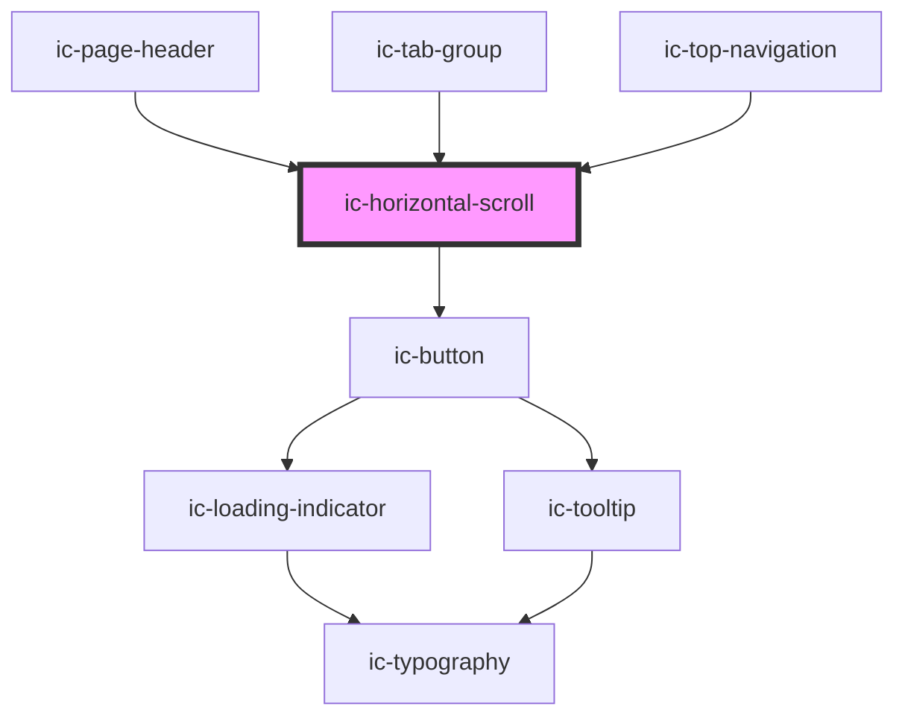

# ic-horizontal-scroll

<!-- Auto Generated Below -->

## Properties

| Property     | Attribute    | Description                                                               | Type                             | Default     |
| ------------ | ------------ | ------------------------------------------------------------------------- | -------------------------------- | ----------- |
| `appearance` | `appearance` | The appearance of the horizontal scroll, e.g. dark, light or the default. | `"dark" \| "default" \| "light"` | `"default"` |

## Dependencies

### Used by

 - [ic-page-header](../ic-page-header)
 - [ic-tab-group](../ic-tab-group)
 - [ic-top-navigation](../ic-top-navigation)

### Depends on

- [ic-button](../ic-button)

### Graph

----------------------------------------------

