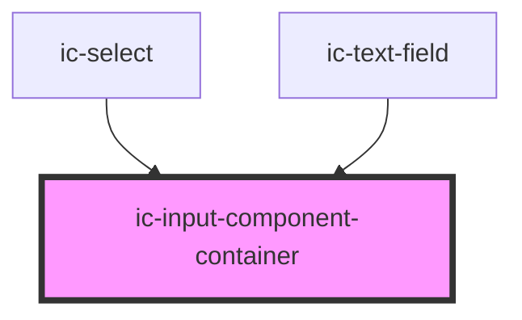

# ic-input-container

<!-- Auto Generated Below -->

## Properties

| Property           | Attribute           | Description                                                                                               | Type                                      | Default |
| ------------------ | ------------------- | --------------------------------------------------------------------------------------------------------- | ----------------------------------------- | ------- |
| `dark`             | `dark`              | Determines whether the dark variant of the input-component-container focus indicator should be displayed. | `boolean`                                 | `false` |
| `disabled`         | `disabled`          | disabled                                                                                                  | `boolean`                                 | `false` |
| `fullWidth`        | `full-width`        | If true then fill width of container                                                                      | `boolean`                                 | `false` |
| `multiLine`        | `multi-line`        | multiLine                                                                                                 | `boolean`                                 | `false` |
| `readonly`         | `readonly`          | readonly                                                                                                  | `boolean`                                 | `false` |
| `small`            | `small`             | small                                                                                                     | `boolean`                                 | `false` |
| `validationInline` | `validation-inline` | validationInline                                                                                          | `boolean`                                 | `false` |
| `validationStatus` | `validation-status` | validationStatus                                                                                          | `"" \| "error" \| "success" \| "warning"` | `""`    |

## Slots

| Slot          | Description                                      |
| ------------- | ------------------------------------------------ |
| `"left-icon"` | Content will be placed to the left of the input. |

## CSS Custom Properties

| Name             | Description                                    |
| ---------------- | ---------------------------------------------- |
| `--border-color` | Border colour of the input component container |

## Dependencies

### Used by

 - [ic-select](../ic-select)
 - [ic-text-field](../ic-text-field)

### Graph

----------------------------------------------

