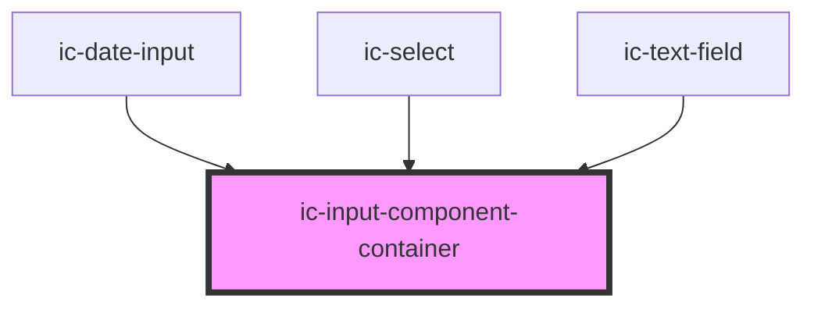

# ic-input-container

<!-- Auto Generated Below -->

## Properties

| Property           | Attribute           | Description                                                                                                                         | Type                                      | Default     |
| ------------------ | ------------------- | ----------------------------------------------------------------------------------------------------------------------------------- | ----------------------------------------- | ----------- |
| `dark`             | `dark`              | If `true`, the dark variant of the input component container will be displayed.                                                     | `boolean`                                 | `false`     |
| `disabled`         | `disabled`          | If `true`, the disabled state will be set.                                                                                          | `boolean`                                 | `false`     |
| `fullWidth`        | `full-width`        | If `true`, the input component container will fill the width of the container it is in.                                             | `boolean`                                 | `false`     |
| `multiLine`        | `multi-line`        | If `true`, the input component container will allow for multiple lines.                                                             | `boolean`                                 | `false`     |
| `readonly`         | `readonly`          | If `true`, the readonly state will be set.                                                                                          | `boolean`                                 | `false`     |
| `size`             | `size`              | The size of the input component container.                                                                                          | `"default" \| "large" \| "small"`         | `"default"` |
| `small`            | `small`             | **[DEPRECATED]** This prop should not be used anymore. Set prop `size` to "small" instead.   | `boolean`                                 | `false`     |
| `validationInline` | `validation-inline` | If `true`, the validation will display inline.                                                                                      | `boolean`                                 | `false`     |
| `validationStatus` | `validation-status` | The validation status of the input component container - e.g. 'error' \| 'warning' \| 'success'.                                    | `"" \| "error" \| "success" \| "warning"` | `""`        |

## Slots

| Slot          | Description                                      |
| ------------- | ------------------------------------------------ |
| `"left-icon"` | Content will be placed to the left of the input. |

## CSS Custom Properties

| Name             | Description                                    |
| ---------------- | ---------------------------------------------- |
| `--border-color` | Border colour of the input component container |

## Dependencies

### Used by

 - [ic-date-input](../ic-date-input)
 - [ic-select](../ic-select)
 - [ic-text-field](../ic-text-field)

### Graph

----------------------------------------------

