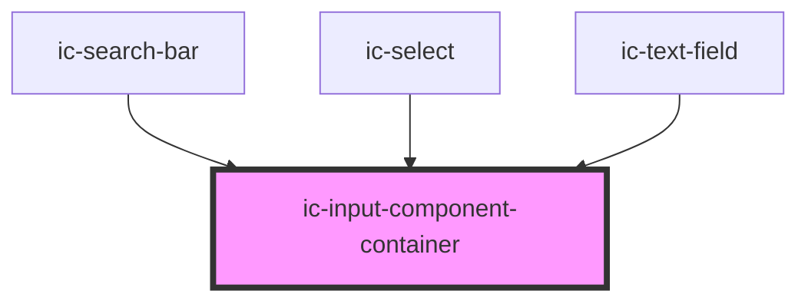

# ic-input-container

<!-- Auto Generated Below -->

## Properties

| Property           | Attribute           | Description                                                                                      | Type                                      | Default    |
| ------------------ | ------------------- | ------------------------------------------------------------------------------------------------ | ----------------------------------------- | ---------- |
| `disabled`         | `disabled`          | If `true`, the disabled state will be set.                                                       | `boolean`                                 | `false`    |
| `fullWidth`        | `full-width`        | If `true`, the input component container will fill the width of the container it is in.          | `boolean`                                 | `false`    |
| `multiLine`        | `multi-line`        | If `true`, the input component container will allow for multiple lines.                          | `boolean`                                 | `false`    |
| `readonly`         | `readonly`          | If `true`, the readonly state will be set.                                                       | `boolean`                                 | `false`    |
| `size`             | `size`              | The size of the input component container component.                                             | `"large" \| "medium" \| "small"`          | `"medium"` |
| `validationInline` | `validation-inline` | If `true`, the validation will display inline.                                                   | `boolean`                                 | `false`    |
| `validationStatus` | `validation-status` | The validation status of the input component container - e.g. 'error' \| 'warning' \| 'success'. | `"" \| "error" \| "success" \| "warning"` | `""`       |

## Slots

| Slot          | Description                                      |
| ------------- | ------------------------------------------------ |
| `"left-icon"` | Content will be placed to the left of the input. |

## CSS Custom Properties

| Name                             | Description                                                                |
| -------------------------------- | -------------------------------------------------------------------------- |
| `--border-color`                 | Border colour of the input component container                             |
| `--border-color-disabled`        | Border colour of the input component container when disabled               |
| `--border-color-error`           | Border colour of the error variant for input component container           |
| `--border-color-error-hover`     | Border colour of the error hover variant for input component container     |
| `--border-color-error-pressed`   | Border colour of the error pressed variant for input component container   |
| `--border-color-hover`           | Border colour of the input component container on hover                    |
| `--border-color-pressed`         | Border colour of the input component container when pressed                |
| `--border-color-success`         | Border colour of the success variant for input component container         |
| `--border-color-success-hover`   | Border colour of the success hover variant for input component container   |
| `--border-color-success-pressed` | Border colour of the success pressed variant for input component container |
| `--border-color-warning`         | Border colour of the warning variant for input component container         |
| `--border-color-warning-hover`   | Border colour of the warning hover variant for input component container   |
| `--border-color-warning-pressed` | Border colour of the warning pressed variant for input component container |

## Dependencies

### Used by

 - [ic-search-bar](../ic-search-bar)
 - [ic-select](../ic-select)
 - [ic-text-field](../ic-text-field)

### Graph

----------------------------------------------

