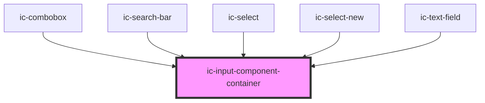

# ic-input-container

<!-- Auto Generated Below -->

## Properties

| Property           | Attribute           | Description                                                                                      | Type                                                   | Default    |
| ------------------ | ------------------- | ------------------------------------------------------------------------------------------------ | ------------------------------------------------------ | ---------- |
| `disabled`         | `disabled`          | If `true`, the disabled state will be set.                                                       | `boolean \| undefined`                                 | `false`    |
| `fullWidth`        | `full-width`        | If `true`, the input component container will fill the width of the container it is in.          | `boolean \| undefined`                                 | `false`    |
| `multiLine`        | `multi-line`        | If `true`, the input component container will allow for multiple lines.                          | `boolean \| undefined`                                 | `false`    |
| `readonly`         | `readonly`          | If `true`, the readonly state will be set.                                                       | `boolean \| undefined`                                 | `false`    |
| `size`             | `size`              | The size of the input component container component.                                             | `"large" \| "medium" \| "small" \| undefined`          | `"medium"` |
| `validationInline` | `validation-inline` | If `true`, the validation will display inline.                                                   | `boolean \| undefined`                                 | `false`    |
| `validationStatus` | `validation-status` | The validation status of the input component container - e.g. 'error' \| 'warning' \| 'success'. | `"" \| "error" \| "success" \| "warning" \| undefined` | `""`       |

## Slots

| Slot          | Description                                      |
| ------------- | ------------------------------------------------ |
| `"left-icon"` | Content will be placed to the left of the input. |

## Dependencies

### Used by

 - [ic-combobox](../ic-combobox)
 - [ic-search-bar](../ic-search-bar)
 - [ic-select](../ic-select)
 - [ic-select-new](../ic-select-new)
 - [ic-text-field](../ic-text-field)

### Graph

----------------------------------------------

