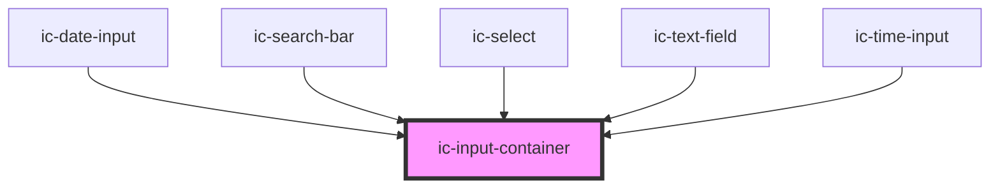

# ic-input-container

<!-- Auto Generated Below -->

## Properties

| Property   | Attribute  | Description                                | Type                   | Default |
| ---------- | ---------- | ------------------------------------------ | ---------------------- | ------- |
| `disabled` | `disabled` | If `true`, the disabled state will be set. | `boolean \| undefined` | `false` |
| `readonly` | `readonly` | If `true`, the readonly state will be set. | `boolean \| undefined` | `false` |

## Dependencies

### Used by

 - [ic-date-input](../../../../canary-web-components/src/components/ic-date-input)
 - [ic-search-bar](../ic-search-bar)
 - [ic-select](../ic-select)
 - [ic-text-field](../ic-text-field)
 - [ic-time-input](../../../../canary-web-components/src/components/ic-time-input)

### Graph

```mermaid
graph TD;
  ic-date-input --> ic-input-container
  ic-search-bar --> ic-input-container
  ic-select --> ic-input-container
  ic-text-field --> ic-input-container
  ic-time-input --> ic-input-container
  style ic-input-container fill:#f9f,stroke:#333,stroke-width:4px
```

----------------------------------------------

