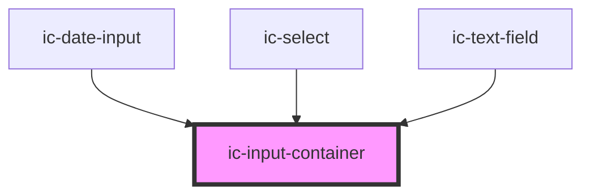

# ic-input-container

<!-- Auto Generated Below -->

## Properties

| Property   | Attribute  | Description                                | Type      | Default |
| ---------- | ---------- | ------------------------------------------ | --------- | ------- |
| `disabled` | `disabled` | If `true`, the disabled state will be set. | `boolean` | `false` |
| `readonly` | `readonly` | If `true`, the readonly state will be set. | `boolean` | `false` |

## Dependencies

### Used by

 - [ic-date-input](../ic-date-input)
 - [ic-select](../ic-select)
 - [ic-text-field](../ic-text-field)

### Graph

----------------------------------------------

