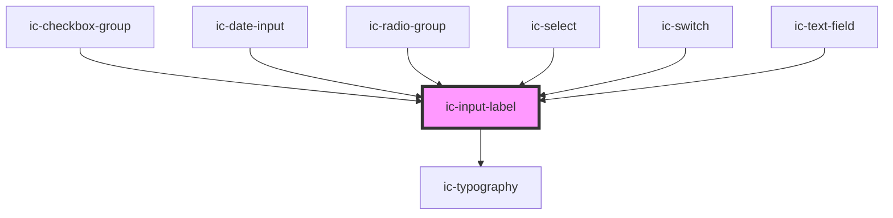

# ic-input-label

<!-- Auto Generated Below -->

## Properties

| Property             | Attribute     | Description                                                       | Type      | Default     |
| -------------------- | ------------- | ----------------------------------------------------------------- | --------- | ----------- |
| `dark`               | `dark`        | If `true`, the dark variant of the input label will be displayed. | `boolean` | `false`     |
| `disabled`           | `disabled`    | If `true`, the disabled state will be set.                        | `boolean` | `false`     |
| `error`              | `error`       | If `true`, the input label will display with error styling.       | `boolean` | `false`     |
| `for`                | `for`         | The ID of the form element the label is bound to.                 | `string`  | `undefined` |
| `helperText`         | `helper-text` | The helper text that will be displayed.                           | `string`  | `""`        |
| `label` _(required)_ | `label`       | The text content of the label.                                    | `string`  | `undefined` |
| `readonly`           | `readonly`    | If `true`, the readonly state will be set.                        | `boolean` | `false`     |
| `required`           | `required`    | If `true`, the input label will require a value.                  | `boolean` | `false`     |

## Dependencies

### Used by

 - [ic-checkbox-group](../ic-checkbox-group)
 - [ic-date-input](../ic-date-input)
 - [ic-radio-group](../ic-radio-group)
 - [ic-select](../ic-select)
 - [ic-switch](../ic-switch)
 - [ic-text-field](../ic-text-field)

### Depends on

- [ic-typography](../ic-typography)

### Graph

----------------------------------------------

