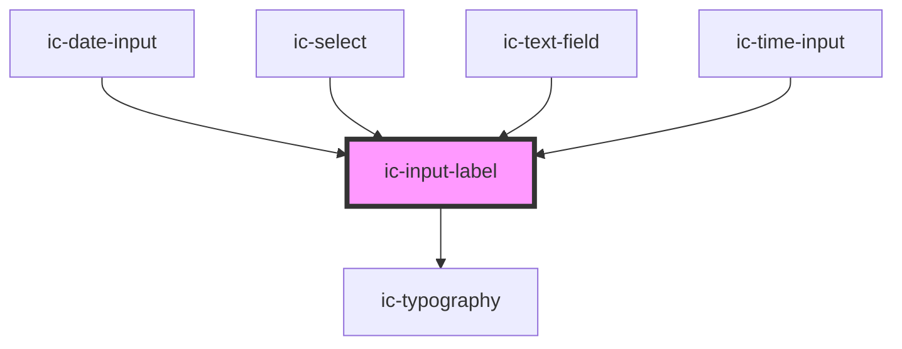

# ic-input-label

<!-- Auto Generated Below -->

## Properties

| Property             | Attribute     | Description                                       | Type                   | Default     |
| -------------------- | ------------- | ------------------------------------------------- | ---------------------- | ----------- |
| `disabled`           | `disabled`    | If `true`, the disabled state will be set.        | `boolean \| undefined` | `false`     |
| `for`                | `for`         | The ID of the form element the label is bound to. | `string \| undefined`  | `undefined` |
| `helperText`         | `helper-text` | The helper text that will be displayed.           | `string`               | `""`        |
| `hideLabel`          | `hide-label`  | The label will be visually hidden.                | `boolean`              | `false`     |
| `label` _(required)_ | `label`       | The text content of the label.                    | `string`               | `undefined` |
| `readonly`           | `readonly`    | If `true`, the readonly state will be set.        | `boolean`              | `false`     |
| `required`           | `required`    | If `true`, the input label will require a value.  | `boolean`              | `false`     |
| `status`             | `status`      | The status of the label - e.g. 'error'.           | `"" \| "error"`        | `""`        |

## Dependencies

### Used by

 - [ic-date-input](../../../../canary-web-components/src/components/ic-date-input)
 - [ic-select](../ic-select)
 - [ic-text-field](../ic-text-field)
 - [ic-time-input](../../../../canary-web-components/src/components/ic-time-input)

### Depends on

- [ic-typography](../ic-typography)

### Graph

```mermaid
graph TD;
  ic-input-label --> ic-typography
  ic-date-input --> ic-input-label
  ic-select --> ic-input-label
  ic-text-field --> ic-input-label
  ic-time-input --> ic-input-label
  style ic-input-label fill:#f9f,stroke:#333,stroke-width:4px
```

----------------------------------------------

