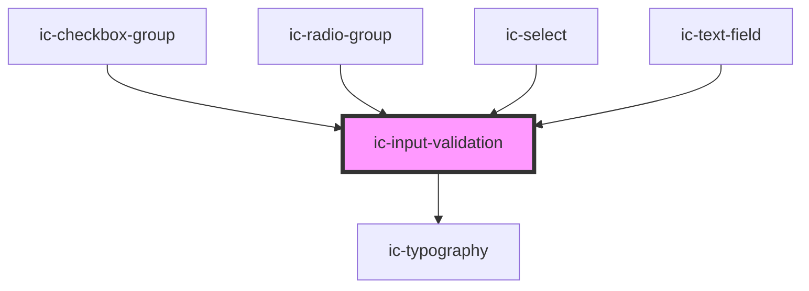

# ic-input-validation

<!-- Auto Generated Below -->

## Properties

| Property               | Attribute        | Description                                      | Type                                      | Default     |
| ---------------------- | ---------------- | ------------------------------------------------ | ----------------------------------------- | ----------- |
| `ariaLiveMode`         | `aria-live-mode` | aria live mode to apply to message               | `"assertive" \| "polite"`                 | `"polite"`  |
| `for`                  | `for`            | The id of the input field the message relates to | `string`                                  | `undefined` |
| `fullWidth`            | `full-width`     | If true then fill width of container             | `boolean`                                 | `false`     |
| `message` _(required)_ | `message`        | The validation message to display                | `string`                                  | `undefined` |
| `status`               | `status`         | The status                                       | `"" \| "error" \| "success" \| "warning"` | `""`        |

## Slots

| Slot                             | Description                                                    |
| -------------------------------- | -------------------------------------------------------------- |
| `"validation-message-adornment"` | Content will be placed to the right of the validation message. |

## Dependencies

### Used by

 - [ic-checkbox-group](../ic-checkbox-group)
 - [ic-radio-group](../ic-radio-group)
 - [ic-select](../ic-select)
 - [ic-text-field](../ic-text-field)

### Depends on

- [ic-typography](../ic-typography)

### Graph

----------------------------------------------

