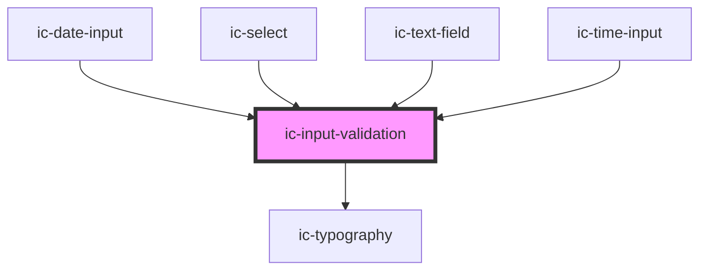

# ic-input-validation

<!-- Auto Generated Below -->

## Properties

| Property       | Attribute        | Description                                                            | Type                                                   | Default     |
| -------------- | ---------------- | ---------------------------------------------------------------------- | ------------------------------------------------------ | ----------- |
| `ariaLiveMode` | `aria-live-mode` | The ARIA live mode to apply to the message.                            | `"assertive" \| "off" \| "polite" \| undefined`        | `"polite"`  |
| `for`          | `for`            | The ID of the form element the validation is bound to.                 | `string \| undefined`                                  | `undefined` |
| `fullWidth`    | `full-width`     | If `true`, the input validation will fill the width of the container.  | `boolean \| undefined`                                 | `false`     |
| `message`      | `message`        | The validation message to display.                                     | `string \| undefined`                                  | `undefined` |
| `status`       | `status`         | The status of the validation - e.g. 'error' \| 'warning' \| 'success'. | `"" \| "error" \| "success" \| "warning" \| undefined` | `""`        |

## Slots

| Slot                             | Description                                                    |
| -------------------------------- | -------------------------------------------------------------- |
| `"validation-message"`           | Content will be placed as the validation message.              |
| `"validation-message-adornment"` | Content will be placed to the right of the validation message. |

## Dependencies

### Used by

 - [ic-date-input](../../../../canary-web-components/src/components/ic-date-input)
 - [ic-select](../ic-select)
 - [ic-text-field](../ic-text-field)
 - [ic-time-input](../../../../canary-web-components/src/components/ic-time-input)

### Depends on

- [ic-typography](../ic-typography)

### Graph

```mermaid
graph TD;
  ic-input-validation --> ic-typography
  ic-date-input --> ic-input-validation
  ic-select --> ic-input-validation
  ic-text-field --> ic-input-validation
  ic-time-input --> ic-input-validation
  style ic-input-validation fill:#f9f,stroke:#333,stroke-width:4px
```

----------------------------------------------

