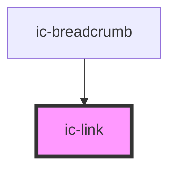

# ic-link

<!-- Auto Generated Below -->

## Properties

| Property         | Attribute        | Description                                                                                     | Type                                                                                                                                                                                     | Default     |
| ---------------- | ---------------- | ----------------------------------------------------------------------------------------------- | ---------------------------------------------------------------------------------------------------------------------------------------------------------------------------------------- | ----------- |
| `appearance`     | `appearance`     | Determines the whether the appearance is dark, light, or the default.                           | `"dark" \| "default" \| "light"`                                                                                                                                                         | `"default"` |
| `download`       | `download`       | Prompts the user to save the linked URL instead of navigating to it.                            | `boolean \| string`                                                                                                                                                                      | `false`     |
| `href`           | `href`           | The URL that the link points to.                                                                | `string`                                                                                                                                                                                 | `null`      |
| `hreflang`       | `hreflang`       | Hints at the human language of the linked URL.                                                  | `string`                                                                                                                                                                                 | `undefined` |
| `referrerpolicy` | `referrerpolicy` | How much of the referrer to send when following the link.                                       | `"" \| "no-referrer" \| "no-referrer-when-downgrade" \| "origin" \| "origin-when-cross-origin" \| "same-origin" \| "strict-origin" \| "strict-origin-when-cross-origin" \| "unsafe-url"` | `undefined` |
| `rel`            | `rel`            | The relationship of the linked URL as space-separated link types.                               | `string`                                                                                                                                                                                 | `undefined` |
| `showIcon`       | `show-icon`      | Determines whether the 'open in new tab/window' icon is to be displayed.                        | `boolean`                                                                                                                                                                                | `undefined` |
| `target`         | `target`         | Where to display the linked URL, as the name for a browsing context (a tab, window, or iframe). | `string`                                                                                                                                                                                 | `undefined` |

## Slots

| Slot            | Description                                        |
| --------------- | -------------------------------------------------- |
| `"router-item"` | Handle routing by nesting your routes in this slot |

## Dependencies

### Used by

 - [ic-breadcrumb](../ic-breadcrumb)

### Graph

----------------------------------------------

