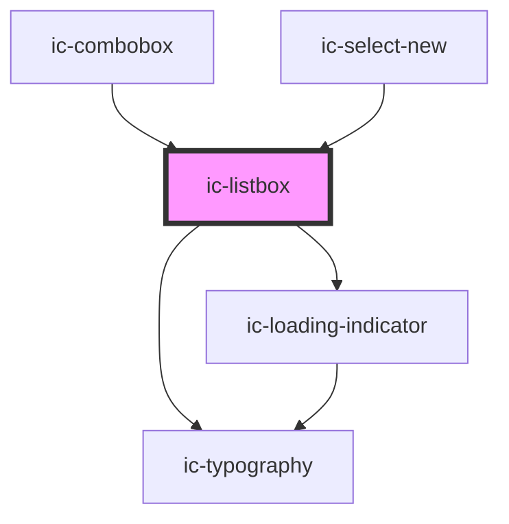

# ic-menu

<!-- Auto Generated Below -->

## Properties

| Property                 | Attribute                | Description                                                                          | Type                         | Default     |
| ------------------------ | ------------------------ | ------------------------------------------------------------------------------------ | ---------------------------- | ----------- |
| `activedescendantIndex`  | `activedescendant-index` |                                                                                      | `null \| number`             | `null`      |
| `anchorEl`               | --                       | The reference to an anchor element the menu will position itself from when rendered. | `HTMLElement \| undefined`   | `undefined` |
| `listboxId` _(required)_ | `listbox-id`             | The ID of the menu.                                                                  | `string`                     | `undefined` |
| `open` _(required)_      | `open`                   | If `true`, the menu will be displayed open.                                          | `boolean`                    | `undefined` |
| `options` _(required)_   | --                       | The possible menu selection options.                                                 | `IcMenuOption[]`             | `undefined` |
| `value`                  | `value`                  |                                                                                      | `null \| string \| string[]` | `null`      |

## Dependencies

### Used by

 - [ic-combobox](../ic-combobox)
 - [ic-select-new](../ic-select-new)

### Depends on

- [ic-loading-indicator](../ic-loading-indicator)
- [ic-typography](../ic-typography)

### Graph

----------------------------------------------

