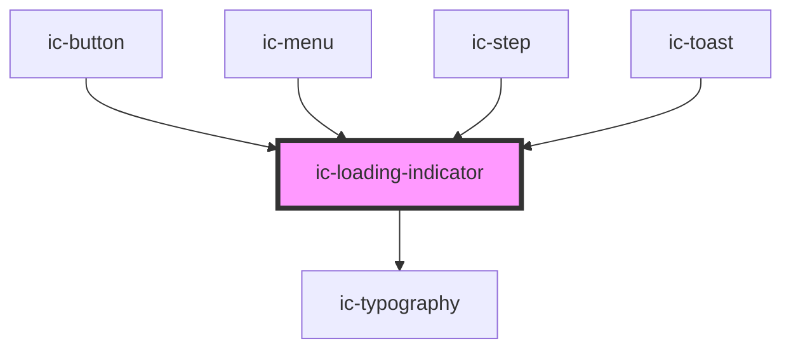

# ic-loading

<!-- Auto Generated Below -->

## Properties

| Property        | Attribute        | Description                                                                                                                             | Type                                                    | Default      |
| --------------- | ---------------- | --------------------------------------------------------------------------------------------------------------------------------------- | ------------------------------------------------------- | ------------ |
| `description`   | `description`    | The description that will be set as the aria-label of the loading indicator when not using a visible label.                             | `string \| undefined`                                   | `"Loading"`  |
| `fullWidth`     | `full-width`     | If `true`, when linear, the full-width variant (i.e. without a border radius) will be displayed.                                        | `boolean \| undefined`                                  | `false`      |
| `label`         | `label`          | The label to be displayed beneath the loading indicator. Display a changing label by supplying an array of messages.                    | `string \| string[] \| undefined`                       | `undefined`  |
| `labelDuration` | `label-duration` | The time in milliseconds before the label changes.                                                                                      | `number \| undefined`                                   | `8000`       |
| `max`           | `max`            | The maximum value that the progress value can take. Used to calculate the proportional width of the progress bar.                       | `number \| undefined`                                   | `100`        |
| `min`           | `min`            | The minimum value that the progress value can take. Used to calculate the proportional width of the progress bar.                       | `number \| undefined`                                   | `0`          |
| `monochrome`    | `monochrome`     | If `true`, the element will display as black and white.                                                                                 | `boolean \| undefined`                                  | `false`      |
| `progress`      | `progress`       | The current amount of progress made. If not provided, component acts as an indeterminate loading indicator.                             | `number \| undefined`                                   | `undefined`  |
| `size`          | `size`           | The size of the loading indicator.                                                                                                      | `"icon" \| "large" \| "medium" \| "small" \| undefined` | `"medium"`   |
| `theme`         | `theme`          | Sets the theme color to the dark or light theme color. "inherit" will set the color based on the system settings or ic-theme component. | `"dark" \| "inherit" \| "light" \| undefined`           | `"inherit"`  |
| `type`          | `type`           | The type of indicator, either linear or circular.                                                                                       | `"circular" \| "linear" \| undefined`                   | `"circular"` |

## Shadow Parts

| Part                     | Description |
| ------------------------ | ----------- |
| `"ic-loading-container"` |             |

## CSS Custom Properties

| Name                  | Description                        |
| --------------------- | ---------------------------------- |
| `--circular-diameter` | Diameter of the circular-indicator |

## Dependencies

### Used by

 - [ic-button](../ic-button)
 - [ic-menu](../ic-menu)
 - [ic-step](../ic-step)
 - [ic-toast](../ic-toast)

### Depends on

- [ic-typography](../ic-typography)

### Graph

----------------------------------------------

