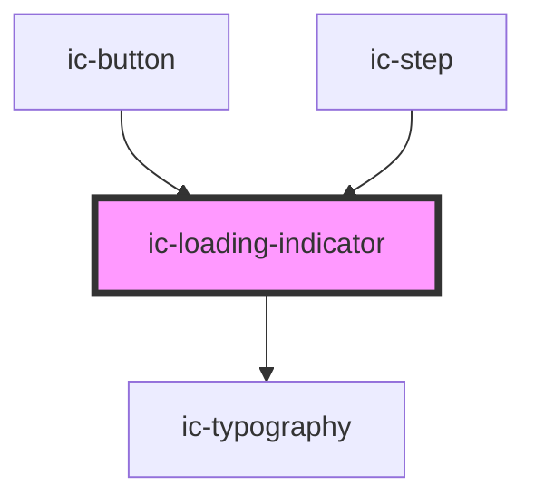

# ic-loading

<!-- Auto Generated Below -->

## Properties

| Property        | Attribute        | Description                                                                                                                             | Type                                        | Default      |
| --------------- | ---------------- | --------------------------------------------------------------------------------------------------------------------------------------- | ------------------------------------------- | ------------ |
| `appearance`    | `appearance`     | Determines whether the dark or light loading indicator should be displayed.                                                             | `"dark" \| "light"`                         | `"dark"`     |
| `description`   | `description`    | Provide a description to be set as the aria-label of the loading indicator when not using a visible label.                              | `string`                                    | `"Loading"`  |
| `fullWidth`     | `full-width`     | When linear, determines whether the full-width version (i.e. without a border radius) should be displayed.                              | `boolean`                                   | `false`      |
| `label`         | `label`          | The label to be displayed beneath the loading indicator. Display a changing label by separating multiple messages with forward slashes. | `string`                                    | `undefined`  |
| `labelDuration` | `label-duration` | The time in milliseconds before the label changes.                                                                                      | `number`                                    | `8000`       |
| `max`           | `max`            | The maximum value that the progress value can take. Used to calculate the proportional width of the progress bar.                       | `number`                                    | `100`        |
| `min`           | `min`            | The minimum value that the progress value can take. Used to calculate the proportional width of the progress bar.                       | `number`                                    | `0`          |
| `progress`      | `progress`       | The current amount of progress made. If not provided, component acts as an indeterminate loading indicator.                             | `number`                                    | `undefined`  |
| `size`          | `size`           | The size of the loading indicator.                                                                                                      | `"default" \| "icon" \| "large" \| "small"` | `"default"`  |
| `type`          | `type`           | The type of indicator, either linear or circular.                                                                                       | `"circular" \| "linear"`                    | `"circular"` |

## CSS Custom Properties

| Name                  | Description                        |
| --------------------- | ---------------------------------- |
| `--circular-diameter` | Diameter of the circular-indicator |

## Dependencies

### Used by

 - [ic-button](../ic-button)
 - [ic-step](../ic-step)

### Depends on

- [ic-typography](../ic-typography)

### Graph

----------------------------------------------

