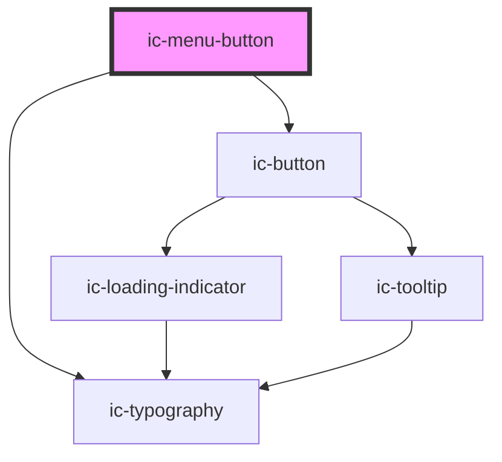

# ic-menu-button

<!-- Auto Generated Below -->

## Properties

| Property             | Attribute             | Description                                                                                                                                    | Type                                                                                                                                                                                     | Default     |
| -------------------- | --------------------- | ---------------------------------------------------------------------------------------------------------------------------------------------- | ---------------------------------------------------------------------------------------------------------------------------------------------------------------------------------------- | ----------- |
| `description`        | `description`         | The description displayed in the menu button, below the label.                                                                                 | `string`                                                                                                                                                                                 | `undefined` |
| `disabled`           | `disabled`            | If `true`, the menu button will be in disabled state.                                                                                          | `boolean`                                                                                                                                                                                | `false`     |
| `href`               | `href`                | The URL that the link points to. This will render the menu button as an "a" tag.                                                               | `string`                                                                                                                                                                                 | `undefined` |
| `hreflang`           | `hreflang`            | The human language of the linked URL.                                                                                                          | `string`                                                                                                                                                                                 | `undefined` |
| `keyboardShortcut`   | `keyboard-shortcut`   | The label describing the keyboard shortcut for a menu button's action.                                                                         | `string`                                                                                                                                                                                 | `undefined` |
| `label` _(required)_ | `label`               | The label to display in the menu button.                                                                                                       | `string`                                                                                                                                                                                 | `undefined` |
| `referrerpolicy`     | `referrerpolicy`      | How much of the referrer to send when following the link.                                                                                      | `"" \| "no-referrer" \| "no-referrer-when-downgrade" \| "origin" \| "origin-when-cross-origin" \| "same-origin" \| "strict-origin" \| "strict-origin-when-cross-origin" \| "unsafe-url"` | `undefined` |
| `rel`                | `rel`                 | The relationship of the linked URL as space-separated link types.                                                                              | `string`                                                                                                                                                                                 | `undefined` |
| `submenuTriggerFor`  | `submenu-trigger-for` | This references the popover menu instance that the menu button is a trigger for. If this prop is set, then the variant will always be default. | `string`                                                                                                                                                                                 | `undefined` |
| `target`             | `target`              | The place to display the linked URL, as the name for a browsing context (a tab, window, or iframe).                                            | `string`                                                                                                                                                                                 | `undefined` |
| `variant`            | `variant`             | The variant of the menu button.                                                                                                                | `"default" \| "destructive" \| "toggle"`                                                                                                                                                 | `"default"` |

## Events

| Event                   | Description | Type                                                   |
| ----------------------- | ----------- | ------------------------------------------------------ |
| `handleMenuButtonClick` |             | `CustomEvent<{ label: string; hasSubMenu: boolean; }>` |

## Slots

| Slot     | Description                                                  |
| -------- | ------------------------------------------------------------ |
| `"icon"` | Content will be placed to the left of the menu button label. |

## Dependencies

### Depends on

- [ic-typography](../ic-typography)
- [ic-button](../ic-button)

### Graph

----------------------------------------------

