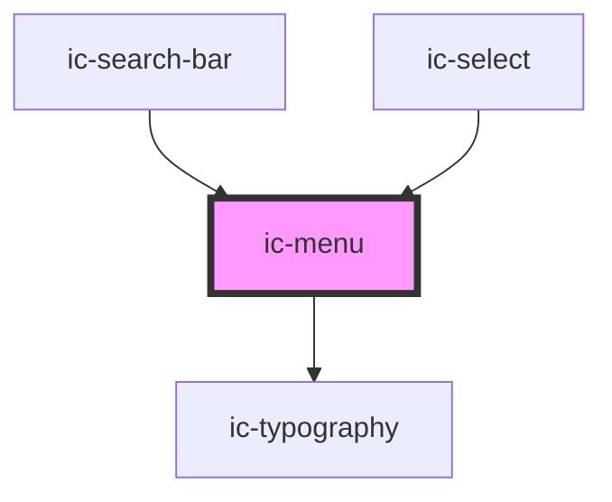

# ic-menu

<!-- Auto Generated Below -->

## Properties

| Property                  | Attribute         | Description                                                                                                                | Type                      | Default       |
| ------------------------- | ----------------- | -------------------------------------------------------------------------------------------------------------------------- | ------------------------- | ------------- |
| `activationType`          | `activation-type` | Determines whether options manually set as values (by pressing 'Enter') when they receive focus using keyboard navigation. | `"automatic" \| "manual"` | `"automatic"` |
| `anchorEl` _(required)_   | --                | The reference to an anchor element the menu will position itself from when rendered.                                       | `HTMLElement`             | `undefined`   |
| `fullWidth`               | `full-width`      | If `true`, the menu will fill the width of the container.                                                                  | `boolean`                 | `false`       |
| `inputEl` _(required)_    | --                | The reference to the input element.                                                                                        | `HTMLElement`             | `undefined`   |
| `inputLabel` _(required)_ | `input-label`     | The label for the input element.                                                                                           | `string`                  | `undefined`   |
| `menuId` _(required)_     | `menu-id`         | The ID of the menu.                                                                                                        | `string`                  | `undefined`   |
| `open` _(required)_       | `open`            | If `true`, the menu will be displayed open.                                                                                | `boolean`                 | `undefined`   |
| `options` _(required)_    | --                | The possible menu selection options.                                                                                       | `IcMenuOption[]`          | `undefined`   |
| `small`                   | `small`           | If `true`, the small styling will be applied to the menu.                                                                  | `boolean`                 | `false`       |
| `value` _(required)_      | `value`           | The value of the currently selected option.                                                                                | `string`                  | `undefined`   |

## Methods

### `handleKeyboardOpen(event: KeyboardEvent) => Promise<void>`

Used alongside activationType
If menu is opened via keyboard navigation (i.e. Enter, ArrowUp or ArrowDown), emit optionSelect custom event.

#### Returns

Type: `Promise<void>`

## CSS Custom Properties

| Name                | Description     |
| ------------------- | --------------- |
| `--ic-z-index-menu` | z-index of menu |

## Dependencies

### Used by

 - [ic-search-bar](../ic-search-bar)
 - [ic-select](../ic-select)

### Depends on

- [ic-typography](../ic-typography)

### Graph

----------------------------------------------

