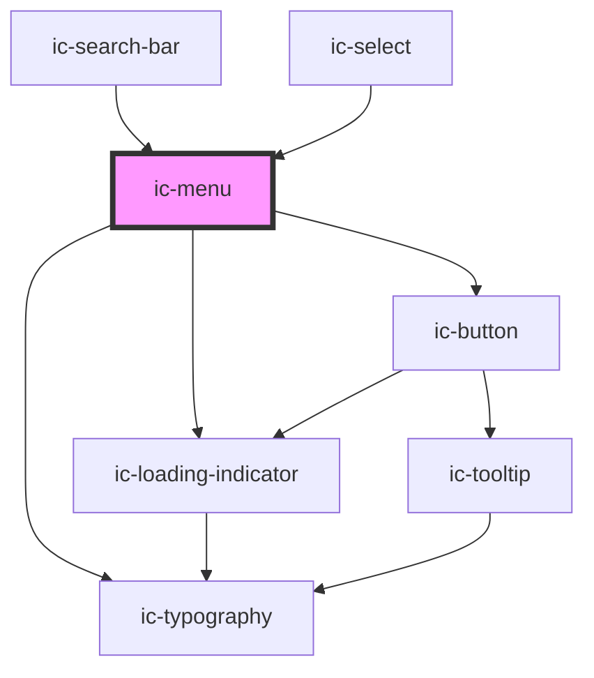

# ic-menu

<!-- Auto Generated Below -->

## Properties

| Property                  | Attribute         | Description                                                                                                                                     | Type                             | Default        |
| ------------------------- | ----------------- | ----------------------------------------------------------------------------------------------------------------------------------------------- | -------------------------------- | -------------- |
| `activationType`          | `activation-type` | Determines whether options manually set as values (by pressing 'Enter') when they receive focus using keyboard navigation.                      | `"automatic" \| "manual"`        | `"automatic"`  |
| `anchorEl` _(required)_   | --                | The reference to an anchor element the menu will position itself from when rendered.                                                            | `HTMLElement`                    | `undefined`    |
| `closeOnSelect`           | `close-on-select` | If `true`, the menu will close when an option is selected.                                                                                      | `boolean`                        | `true`         |
| `fullWidth`               | `full-width`      | If `true`, the menu will fill the width of the container.                                                                                       | `boolean`                        | `false`        |
| `inputEl` _(required)_    | --                | The reference to the input element.                                                                                                             | `HTMLElement`                    | `undefined`    |
| `inputLabel` _(required)_ | `input-label`     | The label for the input element.                                                                                                                | `string`                         | `undefined`    |
| `labelField`              | `label-field`     | The custom name for the label field for IcMenuOption.                                                                                           | `string`                         | `"label"`      |
| `menuId` _(required)_     | `menu-id`         | The ID of the menu.                                                                                                                             | `string`                         | `undefined`    |
| `open` _(required)_       | `open`            | If `true`, the menu will be displayed open.                                                                                                     | `boolean`                        | `undefined`    |
| `options` _(required)_    | --                | The possible menu selection options.                                                                                                            | `IcMenuOption[]`                 | `undefined`    |
| `searchMode`              | `search-mode`     | Specify the mode search bar uses to search. `navigation` allows for quick lookups of a set of values, `query` allows for more general searches. | `"navigation" \| "query"`        | `"navigation"` |
| `size`                    | `size`            | The size of the menu.                                                                                                                           | `"large" \| "medium" \| "small"` | `"medium"`     |
| `value` _(required)_      | `value`           | The value of the currently selected option - or array of values (if multiple options allowed).                                                  | `string \| string[]`             | `undefined`    |
| `valueField`              | `value-field`     | The custom name for the value field for IcMenuOption.                                                                                           | `string`                         | `"value"`      |

## Methods

### `handleKeyboardOpen(event: KeyboardEvent) => Promise<void>`

Used alongside activationType
If menu is opened via keyboard navigation (i.e. Enter, ArrowUp or ArrowDown), emit optionSelect custom event.

#### Parameters

| Name    | Type            | Description                                                               |
| ------- | --------------- | ------------------------------------------------------------------------- |
| `event` | `KeyboardEvent` | The keyboard event which is available when handleKeyboardOpen is invoked. |

#### Returns

Type: `Promise<void>`

## Dependencies

### Used by

 - [ic-search-bar](../ic-search-bar)
 - [ic-select](../ic-select)

### Depends on

- [ic-loading-indicator](../ic-loading-indicator)
- [ic-typography](../ic-typography)
- [ic-button](../ic-button)

### Graph

----------------------------------------------

