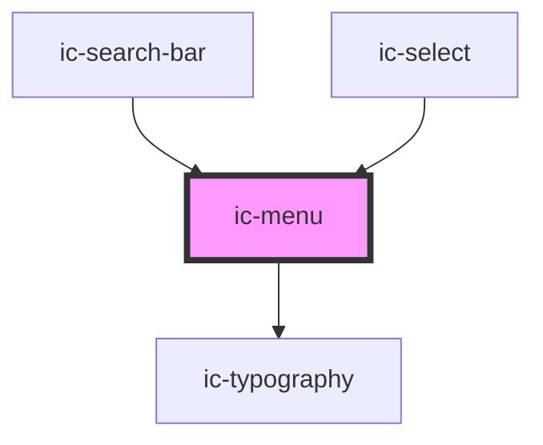

# ic-menu

<!-- Auto Generated Below -->

## Properties

| Property                  | Attribute         | Description                                                                                                                | Type                      | Default       |
| ------------------------- | ----------------- | -------------------------------------------------------------------------------------------------------------------------- | ------------------------- | ------------- |
| `activationType`          | `activation-type` | Determines whether options manually set as values (by pressing 'Enter') when they receive focus using keyboard navigation. | `"automatic" \| "manual"` | `"automatic"` |
| `anchorEl` _(required)_   | --                | Reference to an anchor element the menu will position itself from when rendered.                                           | `HTMLElement`             | `undefined`   |
| `fullWidth`               | `full-width`      | If true then fill width of container                                                                                       | `boolean`                 | `false`       |
| `inputEl` _(required)_    | --                | Reference to the input element.                                                                                            | `HTMLElement`             | `undefined`   |
| `inputLabel` _(required)_ | `input-label`     | Label for the input element.                                                                                               | `string`                  | `undefined`   |
| `menuId` _(required)_     | `menu-id`         | Id of the menu.                                                                                                            | `string`                  | `undefined`   |
| `open` _(required)_       | `open`            | Specify whether the menu is open.                                                                                          | `boolean`                 | `undefined`   |
| `options` _(required)_    | --                | Provide the possible selection options.                                                                                    | `IcMenuOption[]`          | `undefined`   |
| `small`                   | `small`           | Specify whether small styling is to be applied to the element.                                                             | `boolean`                 | `false`       |
| `value` _(required)_      | `value`           | The value of the currently selected option.                                                                                | `string`                  | `undefined`   |

## Events

| Event          | Description                                              | Type                                     |
| -------------- | -------------------------------------------------------- | ---------------------------------------- |
| `menuChange`   | Emitted when state of menu changes (i.e. open or close). | `CustomEvent<IcMenuChangeEventDetail>`   |
| `menuOptionId` | Emitted when an option has been highlighted              | `CustomEvent<IcMenuOptionIdEventDetail>` |
| `optionSelect` | Emitted when an option is selected.                      | `CustomEvent<IcOptionSelectEventDetail>` |

## Methods

### `handleClickOpen() => Promise<void>`

If menu is opened with the mouse, emit menuChange custom event.

#### Returns

Type: `Promise<void>`

### `handleKeyboardOpen(event: KeyboardEvent) => Promise<void>`

Used alongside activationType
If menu is opened via keyboard navigation (i.e. Enter, ArrowUp or ArrowDown), emit optionSelect custom event.

#### Returns

Type: `Promise<void>`

## Dependencies

### Used by

 - [ic-search-bar](../ic-search-bar)
 - [ic-select](../ic-select)

### Depends on

- [ic-typography](../ic-typography)

### Graph

----------------------------------------------

