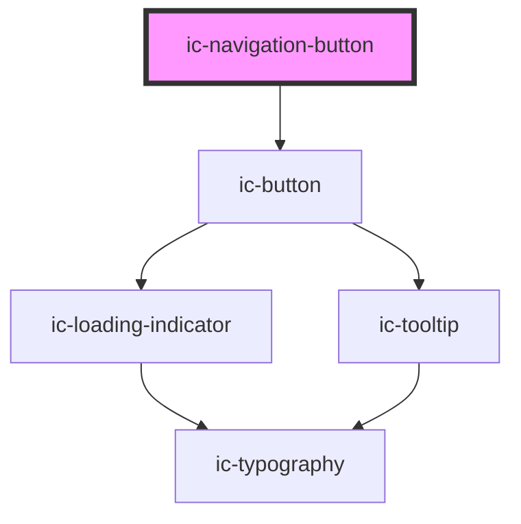

# ic-navigation-button

<!-- Auto Generated Below -->

## Properties

| Property             | Attribute        | Description                                                                                                                             | Type                                                                                                                                                                                                  | Default     |
| -------------------- | ---------------- | --------------------------------------------------------------------------------------------------------------------------------------- | ----------------------------------------------------------------------------------------------------------------------------------------------------------------------------------------------------- | ----------- |
| `download`           | `download`       | If `true`, the user can save the linked URL instead of navigating to it.                                                                | `boolean \| string \| undefined`                                                                                                                                                                      | `false`     |
| `href`               | `href`           | The URL that the link points to. This will render the button as an "a" tag.                                                             | `string \| undefined`                                                                                                                                                                                 | `undefined` |
| `hreflang`           | `hreflang`       | The human language of the linked URL.                                                                                                   | `string \| undefined`                                                                                                                                                                                 | `undefined` |
| `label` _(required)_ | `label`          | The label info to display.                                                                                                              | `string`                                                                                                                                                                                              | `undefined` |
| `referrerpolicy`     | `referrerpolicy` | How much of the referrer to send when following the link.                                                                               | `"" \| "no-referrer" \| "no-referrer-when-downgrade" \| "origin" \| "origin-when-cross-origin" \| "same-origin" \| "strict-origin" \| "strict-origin-when-cross-origin" \| "unsafe-url" \| undefined` | `undefined` |
| `rel`                | `rel`            | The relationship of the linked URL as space-separated link types.                                                                       | `string \| undefined`                                                                                                                                                                                 | `undefined` |
| `target`             | `target`         | The place to display the linked URL, as the name for a browsing context (a tab, window, or iframe).                                     | `string \| undefined`                                                                                                                                                                                 | `undefined` |
| `theme`              | `theme`          | Sets the theme color to the dark or light theme color. "inherit" will set the color based on the system settings or ic-theme component. | `"dark" \| "inherit" \| "light" \| undefined`                                                                                                                                                         | `"inherit"` |

## Methods

### `setFocus() => Promise<void>`

Sets focus on the native `button`.

#### Returns

Type: `Promise<void>`

## Slots

| Slot      | Description                                             |
| --------- | ------------------------------------------------------- |
| `"badge"` | Badge component overlaying the top right of the button. |
| `"icon"`  | Content will be placed to the left of the button label. |

## Dependencies

### Depends on

- [ic-button](../ic-button)

### Graph

----------------------------------------------

