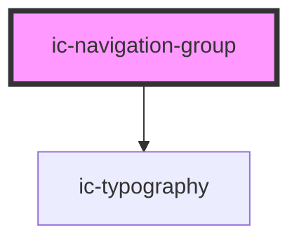

# ic-navigation-group

<!-- Auto Generated Below -->

## Properties

| Property     | Attribute    | Description                                                         | Type      | Default     |
| ------------ | ------------ | ------------------------------------------------------------------- | --------- | ----------- |
| `expandable` | `expandable` | whether the group should be expandable/collapsible in the side menu | `boolean` | `false`     |
| `label`      | `label`      | label to display on the group                                       | `string`  | `undefined` |

## Methods

### `setFocus() => Promise<void>`

Sets focus on the nav item

#### Returns

Type: `Promise<void>`

## Dependencies

### Depends on

- [ic-typography](../ic-typography)

### Graph

----------------------------------------------

