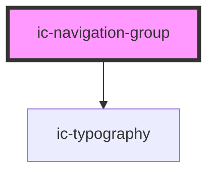

# ic-navigation-group

<!-- Auto Generated Below -->

## Properties

| Property             | Attribute    | Description                                                                                                                                                                    | Type                             | Default     |
| -------------------- | ------------ | ------------------------------------------------------------------------------------------------------------------------------------------------------------------------------ | -------------------------------- | ----------- |
| `expandable`         | `expandable` | If `true`, the group will be expandable when in an ic-side-navigation component, or, when in an ic-top-navigation component, in the side menu displayed at small screen sizes. | `boolean`                        | `false`     |
| `label` _(required)_ | `label`      | The label to display on the group.                                                                                                                                             | `string`                         | `undefined` |
| `theme`              | `theme`      | Sets the theme color to the dark or light theme color. "inherit" will set the color based on the system settings or ic-theme component.                                        | `"dark" \| "inherit" \| "light"` | `"inherit"` |

## Methods

### `setFocus() => Promise<void>`

Sets focus on the nav item.

#### Returns

Type: `Promise<void>`

## CSS Custom Properties

| Name                           | Description                      |
| ------------------------------ | -------------------------------- |
| `--ic-z-index-navigation-item` | z-index of navigation group item |

## Dependencies

### Depends on

- [ic-typography](../ic-typography)

### Graph

----------------------------------------------

