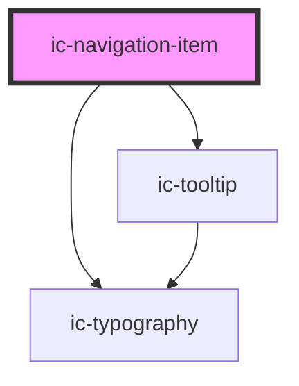

# ic-navigation-item

<!-- Auto Generated Below -->

## Properties

| Property   | Attribute  | Description                                                     | Type      | Default     |
| ---------- | ---------- | --------------------------------------------------------------- | --------- | ----------- |
| `href`     | `href`     | The destination of the navigation item.                         | `string`  | `""`        |
| `label`    | `label`    | The label of the navigation item.                               | `string`  | `undefined` |
| `selected` | `selected` | If `true`, the navigation item will be set in a selected state. | `boolean` | `false`     |

## Methods

### `setFocus() => Promise<void>`

Sets focus on the nav item

#### Returns

Type: `Promise<void>`

## Shadow Parts

| Part     | Description                         |
| -------- | ----------------------------------- |
| `"link"` | The `<a>` within ic-navigation-item |

## Dependencies

### Depends on

- [ic-typography](../ic-typography)
- [ic-tooltip](../ic-tooltip)

### Graph

----------------------------------------------

