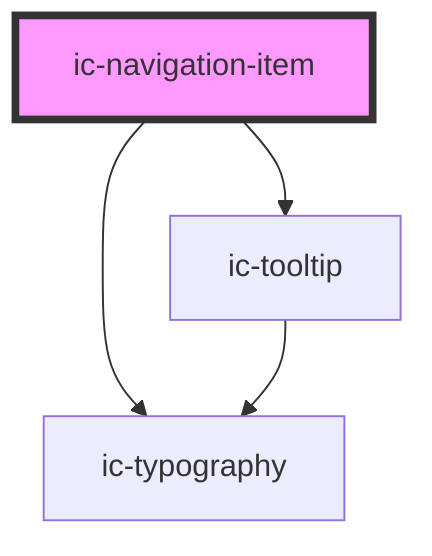

# ic-navigation-item

<!-- Auto Generated Below -->

## Properties

| Property         | Attribute        | Description                                                                                         | Type                                                                                                                                                                                     | Default     |
| ---------------- | ---------------- | --------------------------------------------------------------------------------------------------- | ---------------------------------------------------------------------------------------------------------------------------------------------------------------------------------------- | ----------- |
| `download`       | `download`       | If `true`, the user can save the linked URL instead of navigating to it.                            | `boolean \| string`                                                                                                                                                                      | `false`     |
| `href`           | `href`           | The destination of the navigation item.                                                             | `string`                                                                                                                                                                                 | `""`        |
| `hreflang`       | `hreflang`       | The human language of the linked URL.                                                               | `string`                                                                                                                                                                                 | `undefined` |
| `label`          | `label`          | The label of the navigation item.                                                                   | `string`                                                                                                                                                                                 | `undefined` |
| `referrerpolicy` | `referrerpolicy` | How much of the referrer to send when following the link.                                           | `"" \| "no-referrer" \| "no-referrer-when-downgrade" \| "origin" \| "origin-when-cross-origin" \| "same-origin" \| "strict-origin" \| "strict-origin-when-cross-origin" \| "unsafe-url"` | `undefined` |
| `rel`            | `rel`            | The relationship of the linked URL as space-separated link types.                                   | `string`                                                                                                                                                                                 | `undefined` |
| `selected`       | `selected`       | If `true`, the navigation item will be set in a selected state.                                     | `boolean`                                                                                                                                                                                | `false`     |
| `target`         | `target`         | The place to display the linked URL, as the name for a browsing context (a tab, window, or iframe). | `string`                                                                                                                                                                                 | `undefined` |

## Methods

### `setFocus() => Promise<void>`

Sets focus on the nav item.

#### Returns

Type: `Promise<void>`

## Slots

| Slot      | Description                                                                                                                                       |
| --------- | ------------------------------------------------------------------------------------------------------------------------------------------------- |
| `"badge"` | Badge component overlaying the top right of the icon.                                                                                             |
| `"icon"`  | Content will be displayed to the left of the label for expanded navigation items, and in replacement of the label for collapsed navigation items. |

## Shadow Parts

| Part     | Description                         |
| -------- | ----------------------------------- |
| `"link"` | The `<a>` within ic-navigation-item |

## Dependencies

### Depends on

- [ic-typography](../ic-typography)
- [ic-tooltip](../ic-tooltip)

### Graph

----------------------------------------------

