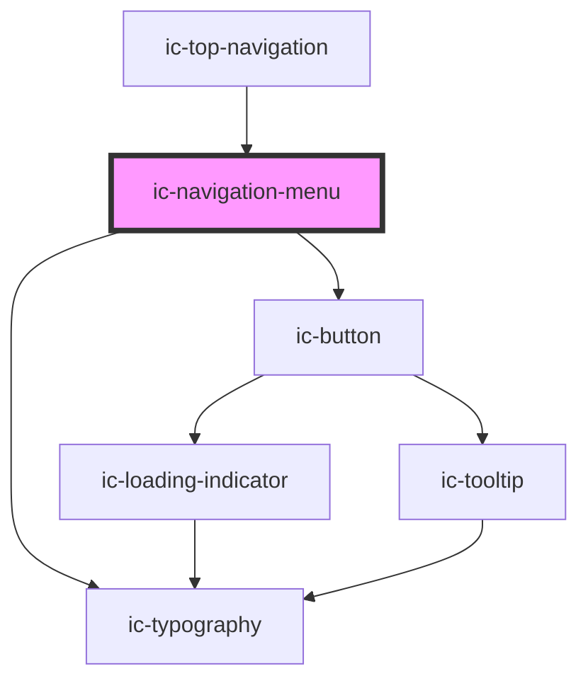

# ic-navigation-menu

<!-- Auto Generated Below -->

## Properties

| Property  | Attribute | Description                  | Type     | Default |
| --------- | --------- | ---------------------------- | -------- | ------- |
| `status`  | `status`  | The status info to display.  | `string` | `""`    |
| `version` | `version` | The version info to display. | `string` | `""`    |

## Slots

| Slot           | Description                                                       |
| -------------- | ----------------------------------------------------------------- |
| `"buttons"`    | Content will be rendered above version info and below navigation. |
| `"navigation"` | Content will be rendered at top of panel.                         |

## CSS Custom Properties

| Name                           | Description                |
| ------------------------------ | -------------------------- |
| `--ic-z-index-navigation-menu` | z-index of navigation menu |

## Dependencies

### Used by

 - [ic-top-navigation](../ic-top-navigation)

### Depends on

- [ic-button](../ic-button)
- [ic-typography](../ic-typography)

### Graph

----------------------------------------------

