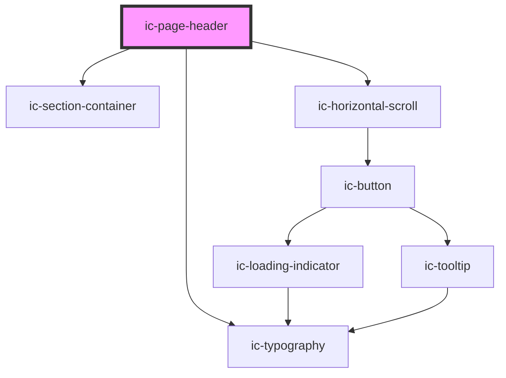

# ic-page-header

<!-- Auto Generated Below -->

## Properties

| Property            | Attribute             | Description                                                                                                                                       | Type                                 | Default     |
| ------------------- | --------------------- | ------------------------------------------------------------------------------------------------------------------------------------------------- | ------------------------------------ | ----------- |
| `aligned`           | `aligned`             | The alignment of the page header.                                                                                                                 | `"center" \| "full-width" \| "left"` | `"left"`    |
| `border`            | `border`              | If `true`, a border will be displayed along the bottom of the page header.                                                                        | `boolean`                            | `true`      |
| `heading`           | `heading`             | The title to render on the page header.                                                                                                           | `string`                             | `undefined` |
| `reverseOrder`      | `reverse-order`       | If `true`, the reading pattern and tab order will change in the action area for viewport widths of above 576px and when actions have not wrapped. | `boolean`                            | `false`     |
| `size`              | `size`                | The size of the page header component.                                                                                                            | `"medium" \| "small"`                | `"medium"`  |
| `sticky`            | `sticky`              | If `true`, the page header will be sticky at all breakpoints.                                                                                     | `boolean`                            | `false`     |
| `stickyDesktopOnly` | `sticky-desktop-only` | If `true`, the page header will only be sticky for viewport widths of 992px and above.                                                            | `boolean`                            | `false`     |
| `subheading`        | `subheading`          | The subtitle to render on the page header.                                                                                                        | `string`                             | `undefined` |

## Slots

| Slot                  | Description                                                                                                                                                |
| --------------------- | ---------------------------------------------------------------------------------------------------------------------------------------------------------- |
| `"actions"`           | Content will be rendered in the action area, adjacent to the title area.                                                                                   |
| `"breadcrumbs"`       | Content will be rendered in the breadcrumb area, above the title and action areas.                                                                         |
| `"heading"`           | Content will be rendered in the title area, in place of the heading.                                                                                       |
| `"heading-adornment"` | Content will be rendered in the title area, adjacent to the heading.                                                                                       |
| `"input"`             | Content will be rendered in the input area, below the title area and adjacent to the action area.                                                          |
| `"stepper"`           | Content will be rendered in the navigation area, below the title and action areas. Note: stepper slot cannot be used when the tabs slot is being used.     |
| `"subheading"`        | Content will be rendered in the title area, in place of the subheading.                                                                                    |
| `"tabs"`              | Content will be rendered in the navigation area, below the title and action areas. Note: the stepper slot cannot be used when the tabs slot is being used. |

## Dependencies

### Depends on

- [ic-section-container](../ic-section-container)
- [ic-typography](../ic-typography)
- [ic-horizontal-scroll](../ic-horizontal-scroll)

### Graph

----------------------------------------------

