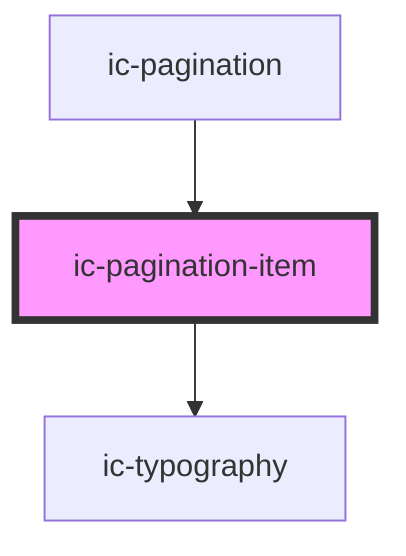

# ic-pagination-item

<!-- Auto Generated Below -->

## Properties

| Property       | Attribute       | Description                                                                                          | Type                                       | Default     |
| -------------- | --------------- | ---------------------------------------------------------------------------------------------------- | ------------------------------------------ | ----------- |
| `appearance`   | `appearance`    | The appearance of the pagination, e.g. dark or light. Default appearance if value not set.           | `"dark" \| "default" \| "light"`           | `undefined` |
| `ariaOverride` | `aria-override` | If true the aria-label is set to `Page X of Y`, where X is the current page and Y is the page count. | `boolean`                                  | `false`     |
| `disabled`     | `disabled`      | If true the item is disabled.                                                                        | `boolean`                                  | `false`     |
| `label`        | `label`         | The label applicable when simple pagination is being used.                                           | `string`                                   | `"Page "`   |
| `page`         | `page`          | The current page number.                                                                             | `number`                                   | `undefined` |
| `pages`        | `pages`         | The total number of pages.                                                                           | `number`                                   | `undefined` |
| `selected`     | `selected`      | If true the pagination item is selected.                                                             | `boolean`                                  | `false`     |
| `type`         | `type`          | The type of pagination item 'page' or 'ellipsis'.                                                    | `"ellipsis" \| "page" \| "simple-current"` | `undefined` |

## Dependencies

### Used by

 - [ic-pagination](../ic-pagination)

### Depends on

- [ic-typography](../ic-typography)

### Graph

----------------------------------------------

