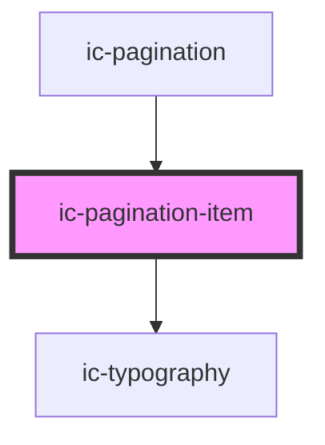

# ic-pagination-item

<!-- Auto Generated Below -->

## Properties

| Property     | Attribute    | Description                                                                                                                             | Type                                          | Default     |
| ------------ | ------------ | --------------------------------------------------------------------------------------------------------------------------------------- | --------------------------------------------- | ----------- |
| `disabled`   | `disabled`   | If `true`, the pagination item will be disabled.                                                                                        | `boolean \| undefined`                        | `false`     |
| `label`      | `label`      | The label for the pagination item (applicable when simple pagination is being used).                                                    | `string \| undefined`                         | `"Page"`    |
| `monochrome` | `monochrome` | If `true`, the pagination item will display as black in the light theme, and white in dark theme.                                       | `boolean \| undefined`                        | `false`     |
| `page`       | `page`       | The current page number.                                                                                                                | `number \| undefined`                         | `undefined` |
| `selected`   | `selected`   | If `true`, the pagination item will be selected.                                                                                        | `boolean`                                     | `false`     |
| `theme`      | `theme`      | Sets the theme color to the dark or light theme color. "inherit" will set the color based on the system settings or ic-theme component. | `"dark" \| "inherit" \| "light" \| undefined` | `"inherit"` |
| `type`       | `type`       | The type of pagination item - 'page' or 'ellipsis'.                                                                                     | `"ellipsis" \| "page" \| "simple-current"`    | `undefined` |

## Dependencies

### Used by

 - [ic-pagination](../ic-pagination)

### Depends on

- [ic-typography](../ic-typography)

### Graph

----------------------------------------------

