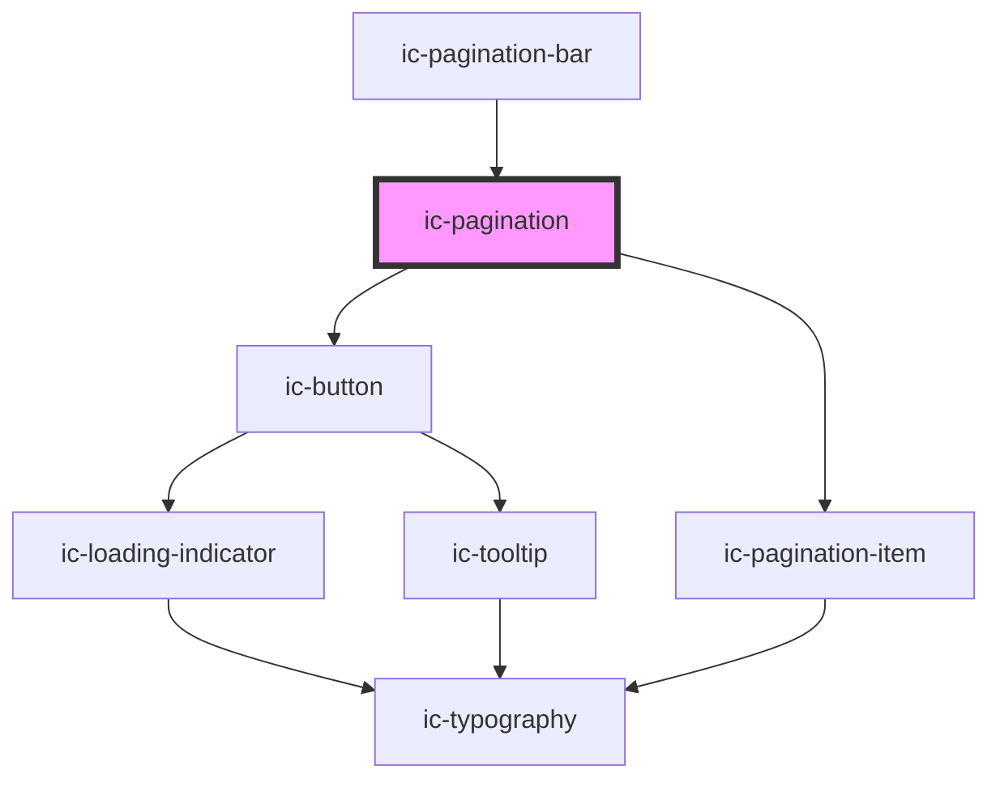

# ic-pagination

<!-- Auto Generated Below -->

## Properties

| Property                     | Attribute                         | Description                                                                                                                             | Type                             | Default            |
| ---------------------------- | --------------------------------- | --------------------------------------------------------------------------------------------------------------------------------------- | -------------------------------- | ------------------ |
| `adjacentCount`              | `adjacent-count`                  | The number of pages displayed adjacent to the current page when using 'complex' type pagination. Accepted values are 0, 1 & 2.          | `number`                         | `1`                |
| `appearance`                 | `appearance`                      | The appearance of the pagination, e.g. dark, light or the default.                                                                      | `"dark" \| "default" \| "light"` | `"default"`        |
| `boundaryCount`              | `boundary-count`                  | The number of pages displayed as boundary items to the current page when using 'complex' type pagination. Accepted values are 0, 1 & 2. | `number`                         | `1`                |
| `currentPage`                | `current-page`                    | The current page displayed by the pagination.                                                                                           | `number`                         | `this.defaultPage` |
| `defaultPage`                | `default-page`                    | The default page to display.                                                                                                            | `number`                         | `1`                |
| `disabled`                   | `disabled`                        | If `true`, the pagination will not allow interaction.                                                                                   | `boolean`                        | `false`            |
| `hideCurrentPage`            | `hide-current-page`               | If `true`, the current page of the simple pagination will not be displayed.                                                             | `boolean`                        | `false`            |
| `hideFirstAndLastPageButton` | `hide-first-and-last-page-button` | If `true`, the first and last page buttons will not be displayed.                                                                       | `boolean`                        | `false`            |
| `label`                      | `label`                           | The label for the pagination item (applicable when simple pagination is being used).                                                    | `string`                         | `"Page"`           |
| `pages` _(required)_         | `pages`                           | The total number of pages.                                                                                                              | `number`                         | `undefined`        |
| `type`                       | `type`                            | The type of pagination to be used.                                                                                                      | `"complex" \| "simple"`          | `"simple"`         |

## Events

| Event          | Description                      | Type                               |
| -------------- | -------------------------------- | ---------------------------------- |
| `icPageChange` | Emitted when a page is selected. | `CustomEvent<IcChangeEventDetail>` |

## Methods

### `setCurrentPage(page: number) => Promise<void>`

Sets the currently displayed page.

#### Returns

Type: `Promise<void>`

## Dependencies

### Used by

 - [ic-pagination-bar](../ic-pagination-bar)

### Depends on

- [ic-button](../ic-button)
- [ic-pagination-item](../ic-pagination-item)

### Graph

----------------------------------------------

