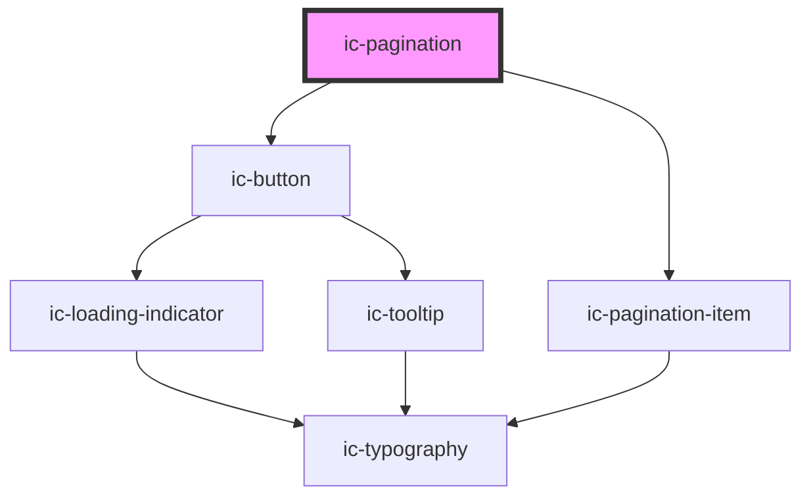

# ic-pagination

<!-- Auto Generated Below -->

## Properties

| Property              | Attribute                | Description                                                                               | Type                             | Default     |
| --------------------- | ------------------------ | ----------------------------------------------------------------------------------------- | -------------------------------- | ----------- |
| `adjacentCount`       | `adjacent-count`         | The number of pages displayed adjacent to the current page.                               | `number`                         | `1`         |
| `appearance`          | `appearance`             | The appearance of the pagination, e.g. dark or light. Default appearance if value not set | `"dark" \| "default" \| "light"` | `"default"` |
| `boundaryCount`       | `boundary-count`         | The number of pages displayed as boundary items to the current page.                      | `number`                         | `1`         |
| `defaultPage`         | `default-page`           | The default page to display.                                                              | `number`                         | `1`         |
| `hideCurrentPage`     | `hide-current-page`      | If `true` the current page in the `simple` appearance will not be displayed.              | `boolean`                        | `false`     |
| `hideFirstPageButton` | `hide-first-page-button` | If `true` the `firstPageButton` will not be displayed.                                    | `boolean`                        | `false`     |
| `hideLastPageButton`  | `hide-last-page-button`  | If `true` the `lastPageButton` will not be displayed.                                     | `boolean`                        | `false`     |
| `loading`             | `loading`                | If `true` the Pagination component will not allow interaction.                            | `boolean`                        | `false`     |
| `pages` _(required)_  | `pages`                  | The total number of pages.                                                                | `number`                         | `undefined` |
| `type`                | `type`                   | The type of Pagination to be used.                                                        | `string`                         | `"simple"`  |

## Dependencies

### Depends on

- [ic-button](../ic-button)
- [ic-pagination-item](../ic-pagination-item)

### Graph

----------------------------------------------

