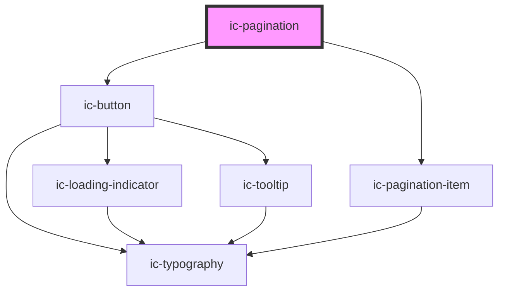

# ic-pagination

<!-- Auto Generated Below -->

## Properties

| Property                     | Attribute                         | Description                                                                                                                             | Type                                          | Default                   |
| ---------------------------- | --------------------------------- | --------------------------------------------------------------------------------------------------------------------------------------- | --------------------------------------------- | ------------------------- |
| `accessibleLabel`            | `accessible-label`                | The accessible label of the pagination component to provide context for screen reader users.                                            | `string \| undefined`                         | `"Pagination Navigation"` |
| `adjacentPageCount`          | `adjacent-page-count`             | The number of pages displayed adjacent to the current page when using 'complex' type pagination. Accepted values are 0, 1 & 2.          | `number \| undefined`                         | `1`                       |
| `boundaryPageCount`          | `boundary-page-count`             | The number of pages displayed as boundary items to the current page when using 'complex' type pagination. Accepted values are 0, 1 & 2. | `number \| undefined`                         | `1`                       |
| `currentPage`                | `current-page`                    | The current page displayed by the pagination.                                                                                           | `number \| undefined`                         | `this.defaultPage`        |
| `defaultPage`                | `default-page`                    | The default page to display.                                                                                                            | `number \| undefined`                         | `1`                       |
| `disabled`                   | `disabled`                        | If `true`, the pagination will not allow interaction.                                                                                   | `boolean \| undefined`                        | `false`                   |
| `hideCurrentPage`            | `hide-current-page`               | If `true`, the current page of the simple pagination will not be displayed.                                                             | `boolean \| undefined`                        | `false`                   |
| `hideFirstAndLastPageButton` | `hide-first-and-last-page-button` | If `true`, the first and last page buttons will not be displayed.                                                                       | `boolean \| undefined`                        | `false`                   |
| `label`                      | `label`                           | The label for the pagination item (applicable when simple pagination is being used).                                                    | `string \| undefined`                         | `"Page"`                  |
| `monochrome`                 | `monochrome`                      | If `true`, the pagination will display as black in the light theme, and white in dark theme.                                            | `boolean \| undefined`                        | `false`                   |
| `pages` _(required)_         | `pages`                           | The total number of pages.                                                                                                              | `number`                                      | `undefined`               |
| `theme`                      | `theme`                           | Sets the theme color to the dark or light theme color. "inherit" will set the color based on the system settings or ic-theme component. | `"dark" \| "inherit" \| "light" \| undefined` | `"inherit"`               |
| `type`                       | `type`                            | The type of pagination to be used.                                                                                                      | `"complex" \| "simple" \| undefined`          | `"simple"`                |

## Events

| Event          | Description                      | Type                               |
| -------------- | -------------------------------- | ---------------------------------- |
| `icPageChange` | Emitted when a page is selected. | `CustomEvent<IcChangeEventDetail>` |

## Methods

### `setCurrentPage(page: number) => Promise<void>`

Sets the currently displayed page.

#### Parameters

| Name   | Type     | Description                                |
| ------ | -------- | ------------------------------------------ |
| `page` | `number` | The page number to set as the current page |

#### Returns

Type: `Promise<void>`

## Dependencies

### Depends on

- [ic-button](../ic-button)
- [ic-pagination-item](../ic-pagination-item)

### Graph

----------------------------------------------

