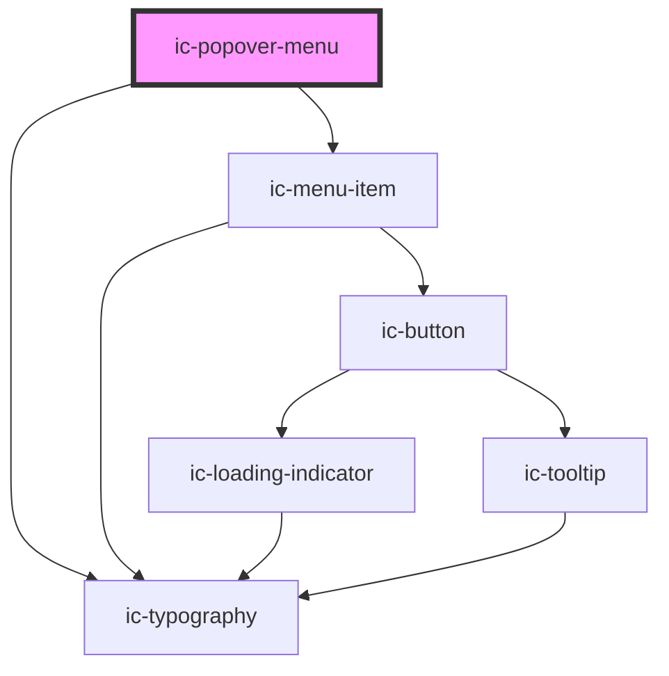

# ic-popover-menu

This is a wrapper component to be placed around one or more ic-menu-item components.

<!-- Auto Generated Below -->

## Properties

| Property    | Attribute    | Description                                                                                                     | Type      | Default     |
| ----------- | ------------ | --------------------------------------------------------------------------------------------------------------- | --------- | ----------- |
| `anchor`    | `anchor`     | The ID of the element the popover menu will anchor itself to. This is required unless the popover is a submenu. | `string`  | `undefined` |
| `open`      | `open`       | If `true`, the popover menu will be displayed.                                                                  | `boolean` | `undefined` |
| `submenuId` | `submenu-id` | The unique identifier for a popover submenu.                                                                    | `string`  | `undefined` |

## Dependencies

### Depends on

- [ic-menu-item](../ic-menu-item)
- [ic-typography](../ic-typography)

### Graph

----------------------------------------------

