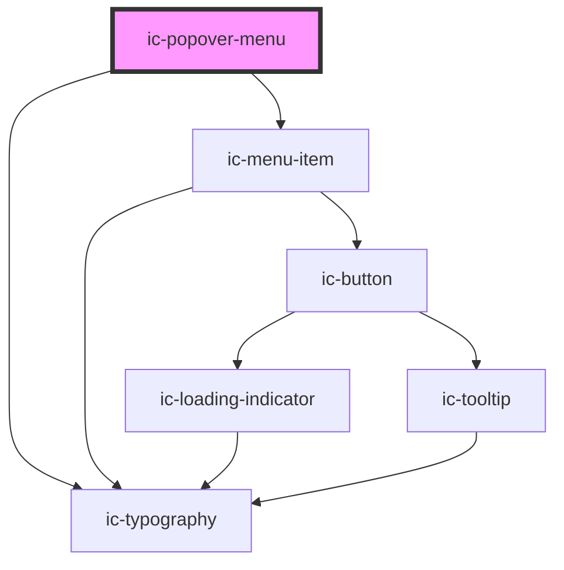

# ic-popover-menu

This is a wrapper component to be placed around one or more ic-menu-item components.

<!-- Auto Generated Below -->

## Properties

| Property                         | Attribute                          | Description                                                                                                                                                                                                                                                                                                                         | Type                       | Default                          |
| -------------------------------- | ---------------------------------- | ----------------------------------------------------------------------------------------------------------------------------------------------------------------------------------------------------------------------------------------------------------------------------------------------------------------------------------- | -------------------------- | -------------------------------- |
| `anchor`                         | `anchor`                           | The ID of the element the popover menu will anchor itself to. This is required unless the popover is a submenu.                                                                                                                                                                                                                     | `string`                   | `undefined`                      |
| `clickEventEle`                  | `click-event-ele`                  | The ID of the element that can open the popover menu if mouseAnchor is set to `true`. If `null`, then use the root element.                                                                                                                                                                                                         | `string`                   | `document.documentElement.id`    |
| `mouseEventCloseButtonPressVals` | --                                 | The MouseEvent.button values that can trigger an ic-popover-menu close. Defaults to `IcPopoverMenuClickEnum.Left` only.                                                                                                                                                                                                             | `IcPopoverMenuClickEnum[]` | `[IcPopoverMenuClickEnum.Left]`  |
| `mouseEventOpenButtonPressVals`  | --                                 | The MouseEvent.button values that can trigger an ic-popover-menu open. Defaults to `IcPopoverMenuClickEnum.Right` only.                                                                                                                                                                                                             | `IcPopoverMenuClickEnum[]` | `[IcPopoverMenuClickEnum.Right]` |
| `open`                           | `open`                             | If `true`, the popover menu will be displayed.                                                                                                                                                                                                                                                                                      | `boolean`                  | `undefined`                      |
| `openOnMouseEventButtonPress`    | `open-on-mouse-event-button-press` | If `true`, the ic-popover-menu will open when a MouseEvent button press occurs. If the "anchor" property element id is defined, this will only happen when clicking within the bounds of the anchor element. ButtonPressVals can be used to define which mouse buttons can trigger this behaviour: by default this is a left click. | `boolean`                  | `false`                          |
| `renderX`                        | `render-x`                         | Absolute screen X co-ordinate for popover menu render position.                                                                                                                                                                                                                                                                     | `number`                   | `null`                           |
| `renderY`                        | `render-y`                         | Absolute screen Y co-ordinate for popover menu render position.                                                                                                                                                                                                                                                                     | `number`                   | `null`                           |
| `submenuId`                      | `submenu-id`                       | The unique identifier for a popover submenu.                                                                                                                                                                                                                                                                                        | `string`                   | `undefined`                      |

## CSS Custom Properties

| Name                   | Description                         |
| ---------------------- | ----------------------------------- |
| `--ic-z-index-popover` | z-index of popover menu.            |
| `--max-height`         | Maximum height of the popover menu. |
| `--popover-width`      | Default width of the popover menu.  |

## Dependencies

### Depends on

- [ic-menu-item](../ic-menu-item)
- [ic-typography](../ic-typography)

### Graph

----------------------------------------------

