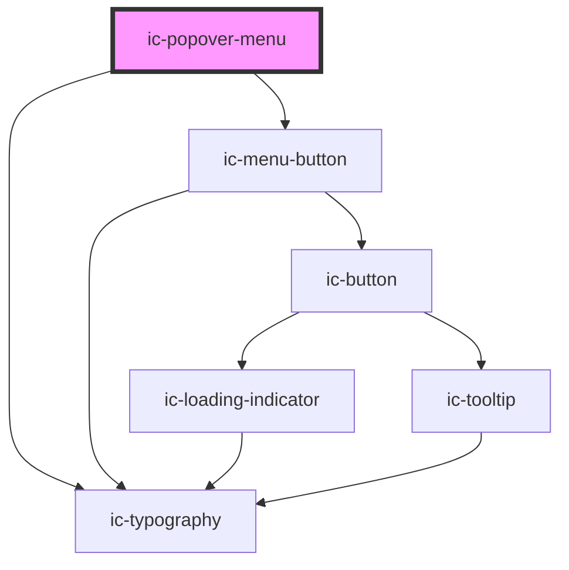

# ic-popover

<!-- Auto Generated Below -->

## Properties

| Property                     | Attribute         | Description                                                                                                     | Type      | Default     |
| ---------------------------- | ----------------- | --------------------------------------------------------------------------------------------------------------- | --------- | ----------- |
| `anchor`                     | `anchor`          | The ID of the element the popover menu will anchor itself to. This is required unless the popover is a submenu. | `string`  | `undefined` |
| `menuAriaLabel` _(required)_ | `menu-aria-label` | The aria label for each popover menu/submenu.                                                                   | `string`  | `undefined` |
| `open`                       | `open`            | If `true`, the popover menu will be displayed.                                                                  | `boolean` | `undefined` |
| `submenuId`                  | `submenu-id`      | The unique identifier for a popover submenu.                                                                    | `string`  | `undefined` |

## Methods

### `openFromChild() => Promise<void>`

#### Returns

Type: `Promise<void>`

### `openFromParent() => Promise<void>`

#### Returns

Type: `Promise<void>`

## CSS Custom Properties

| Name                   | Description                                                                                 |
| ---------------------- | ------------------------------------------------------------------------------------------- |
| `--ic-z-index-popover` | z-index of popover menu                                                                     |
| `--max-height`         | Maximum height of the popover menu @Prop --popover-width: Default width of the popover menu |

## Dependencies

### Depends on

- [ic-menu-button](../ic-menu-button)
- [ic-typography](../ic-typography)

### Graph

----------------------------------------------

