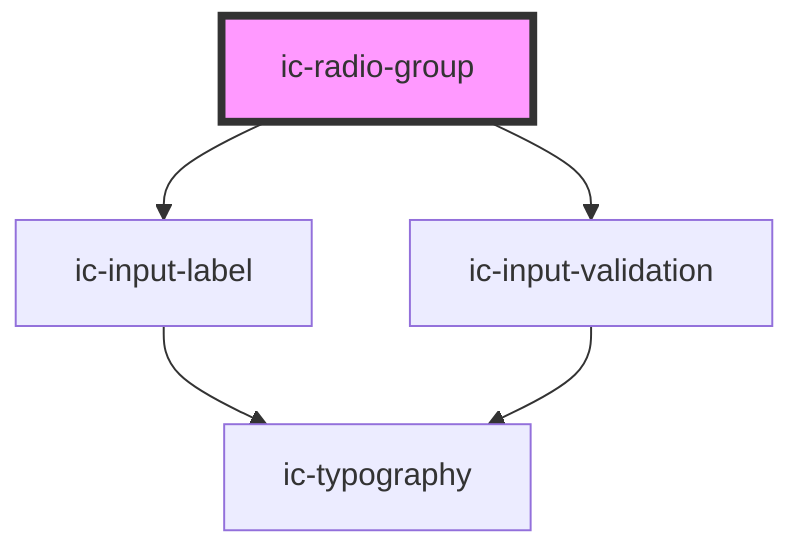

# ic-radio-group

<!-- Auto Generated Below -->

## Properties

| Property             | Attribute           | Description                                                                                                                                                                                                                      | Type                                      | Default      |
| -------------------- | ------------------- | -------------------------------------------------------------------------------------------------------------------------------------------------------------------------------------------------------------------------------- | ----------------------------------------- | ------------ |
| `disabled`           | `disabled`          | If `true`, the disabled state will be set.                                                                                                                                                                                       | `boolean`                                 | `false`      |
| `helperText`         | `helper-text`       | The helper text that will be displayed for additional field guidance.                                                                                                                                                            | `string`                                  | `undefined`  |
| `hideLabel`          | `hide-label`        | If `true`, the label will be hidden and the required label value will be applied as an aria-label.                                                                                                                               | `boolean`                                 | `false`      |
| `label` _(required)_ | `label`             | The label for the radio group to be displayed.                                                                                                                                                                                   | `string`                                  | `undefined`  |
| `name` _(required)_  | `name`              | The name for the radio group to differentiate from other groups.                                                                                                                                                                 | `string`                                  | `undefined`  |
| `orientation`        | `orientation`       | The orientation of the radio buttons in the radio group. If there are more than two radio buttons in a radio group or either of the radio buttons use the `additional-field` slot, then the orientation will always be vertical. | `"horizontal" \| "vertical"`              | `"vertical"` |
| `required`           | `required`          | If `true`, the radio group will require a value.                                                                                                                                                                                 | `boolean`                                 | `false`      |
| `small`              | `small`             | If `true`, the small styling will be applied to the radio group.                                                                                                                                                                 | `boolean`                                 | `false`      |
| `validationStatus`   | `validation-status` | The validation status - e.g. 'error' \| 'warning' \| 'success'.                                                                                                                                                                  | `"" \| "error" \| "success" \| "warning"` | `""`         |
| `validationText`     | `validation-text`   | The validation text - e.g. 'error' \| 'warning' \| 'success'.                                                                                                                                                                    | `string`                                  | `""`         |

## Events

| Event      | Description                          | Type                              |
| ---------- | ------------------------------------ | --------------------------------- |
| `icChange` | Emitted when a user selects a radio. | `CustomEvent<IcValueEventDetail>` |

## Dependencies

### Depends on

- [ic-input-label](../ic-input-label)
- [ic-input-validation](../ic-input-validation)

### Graph

----------------------------------------------

