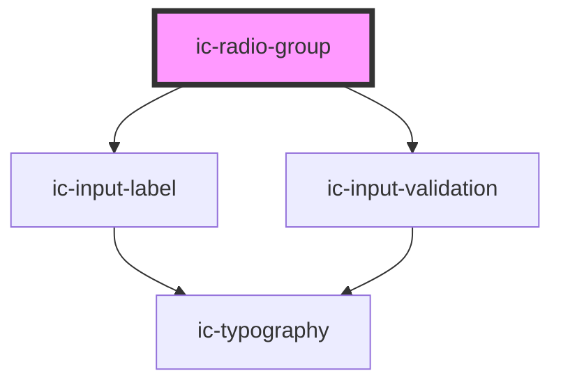

# ic-radio-group

<!-- Auto Generated Below -->

## Properties

| Property             | Attribute              | Description                                                                                                                                                                                                                      | Type                                                   | Default      |
| -------------------- | ---------------------- | -------------------------------------------------------------------------------------------------------------------------------------------------------------------------------------------------------------------------------- | ------------------------------------------------------ | ------------ |
| `disabled`           | `disabled`             | If `true`, the disabled state will be set.                                                                                                                                                                                       | `boolean \| undefined`                                 | `false`      |
| `helperText`         | `helper-text`          | The helper text that will be displayed for additional field guidance.                                                                                                                                                            | `string \| undefined`                                  | `undefined`  |
| `hideLabel`          | `hide-label`           | If `true`, the label will be hidden and the required label value will be applied as an aria-label.                                                                                                                               | `boolean \| undefined`                                 | `false`      |
| `label` _(required)_ | `label`                | The label for the radio group to be displayed.                                                                                                                                                                                   | `string`                                               | `undefined`  |
| `name` _(required)_  | `name`                 | The name for the radio group to differentiate from other groups.                                                                                                                                                                 | `string`                                               | `undefined`  |
| `orientation`        | `orientation`          | The orientation of the radio buttons in the radio group. If there are more than two radio buttons in a radio group or either of the radio buttons use the `additional-field` slot, then the orientation will always be vertical. | `"horizontal" \| "vertical" \| undefined`              | `"vertical"` |
| `required`           | `required`             | If `true`, the radio group will require a value.                                                                                                                                                                                 | `boolean \| undefined`                                 | `false`      |
| `size`               | `size`                 | The size of the radio group component.                                                                                                                                                                                           | `"medium" \| "small" \| undefined`                     | `"medium"`   |
| `theme`              | `theme`                | Sets the theme color to the dark or light theme color. "inherit" will set the color based on the system settings or ic-theme component.                                                                                          | `"dark" \| "inherit" \| "light" \| undefined`          | `"inherit"`  |
| `validationAriaLive` | `validation-aria-live` | The value of the `aria-live` attribute on the validation message.                                                                                                                                                                | `"assertive" \| "off" \| "polite"`                     | `"polite"`   |
| `validationStatus`   | `validation-status`    | The validation status - e.g. 'error' \| 'warning' \| 'success'.                                                                                                                                                                  | `"" \| "error" \| "success" \| "warning" \| undefined` | `""`         |
| `validationText`     | `validation-text`      | The text to display as the validation message.                                                                                                                                                                                   | `string`                                               | `""`         |

## Events

| Event      | Description                          | Type                               |
| ---------- | ------------------------------------ | ---------------------------------- |
| `icChange` | Emitted when a user selects a radio. | `CustomEvent<IcChangeEventDetail>` |

## Slots

| Slot            | Description                                            |
| --------------- | ------------------------------------------------------ |
| `"helper-text"` | Content is set as the helper text for the radio group. |

## Dependencies

### Depends on

- [ic-input-label](../ic-input-label)
- [ic-input-validation](../ic-input-validation)

### Graph

----------------------------------------------

