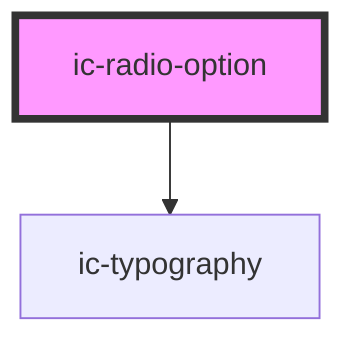

# ic-radio-option

<!-- Auto Generated Below -->

## Properties

| Property                 | Attribute                  | Description                                                          | Type                    | Default                                        |
| ------------------------ | -------------------------- | -------------------------------------------------------------------- | ----------------------- | ---------------------------------------------- |
| `additionalFieldDisplay` | `additional-field-display` | Determines type of additional text field in relation to radio option | `"dynamic" \| "static"` | `"static"`                                     |
| `disabled`               | `disabled`                 | Determines whether the radio should be in disabled state.            | `boolean`               | `false`                                        |
| `dynamicText`            | `dynamic-text`             | Provide a text prop for the dynamic text.                            | `string`                | `"This selection requires additional answers"` |
| `groupLabel`             | `group-label`              | Provide a group label for the input.                                 | `string`                | `undefined`                                    |
| `label`                  | `label`                    | Provide a label for the input.                                       | `string`                | `undefined`                                    |
| `name`                   | `name`                     | Provide a name for the input.                                        | `string`                | `undefined`                                    |
| `selected`               | `selected`                 | Determines whether the radio should be in selected state.            | `boolean`               | `false`                                        |
| `value` _(required)_     | `value`                    | Provide a value for the input.                                       | `string`                | `undefined`                                    |

## Events

| Event               | Description                       | Type                              |
| ------------------- | --------------------------------- | --------------------------------- |
| `icCheck`           | Emitted when radio is checked     | `CustomEvent<void>`               |
| `radioOptionSelect` | Emitted when a radio is selected. | `CustomEvent<IcValueEventDetail>` |

## Dependencies

### Depends on

- [ic-typography](../ic-typography)

### Graph

----------------------------------------------

