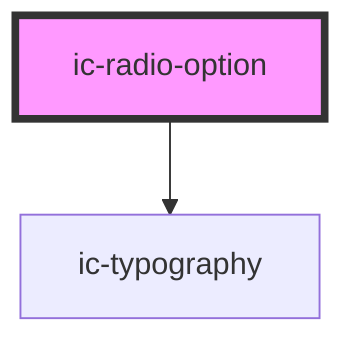

# ic-radio-option

<!-- Auto Generated Below -->

## Properties

| Property                 | Attribute                  | Description                                                        | Type                    | Default                                        |
| ------------------------ | -------------------------- | ------------------------------------------------------------------ | ----------------------- | ---------------------------------------------- |
| `additionalFieldDisplay` | `additional-field-display` | The style of additionalField that will be displayed if used.       | `"dynamic" \| "static"` | `"static"`                                     |
| `disabled`               | `disabled`                 | If `true`, the disabled state will be set.                         | `boolean`               | `false`                                        |
| `dynamicText`            | `dynamic-text`             | The text to be displayed when dynamic.                             | `string`                | `"This selection requires additional answers"` |
| `groupLabel`             | `group-label`              | The group label for the radio option.                              | `string`                | `undefined`                                    |
| `label`                  | `label`                    | The label for the radio option.                                    | `string`                | `undefined`                                    |
| `name`                   | `name`                     | The name for the radio option.                                     | `string`                | `undefined`                                    |
| `selected`               | `selected`                 | If `true`, the radio option will be displayed in a selected state. | `boolean`               | `false`                                        |
| `value` _(required)_     | `value`                    | The value for the radio option.                                    | `string`                | `undefined`                                    |

## Events

| Event               | Description                                                                                                           | Type                              |
| ------------------- | --------------------------------------------------------------------------------------------------------------------- | --------------------------------- |
| `icCheck`           | Emitted when a radio is selected.                                                                                     | `CustomEvent<IcValueEventDetail>` |
| `radioOptionSelect` | **[DEPRECATED]** This event should not be used anymore. Use icCheck instead.   | `CustomEvent<IcValueEventDetail>` |

## Dependencies

### Depends on

- [ic-typography](../ic-typography)

### Graph

----------------------------------------------

